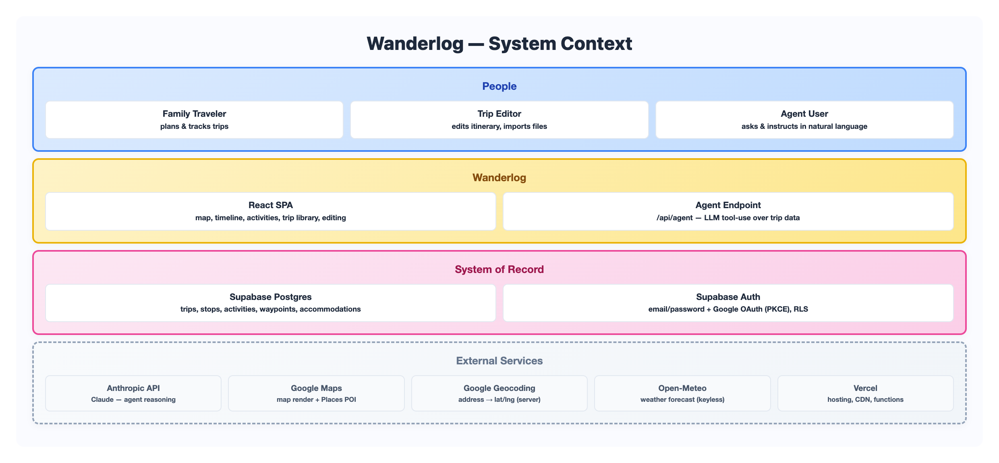
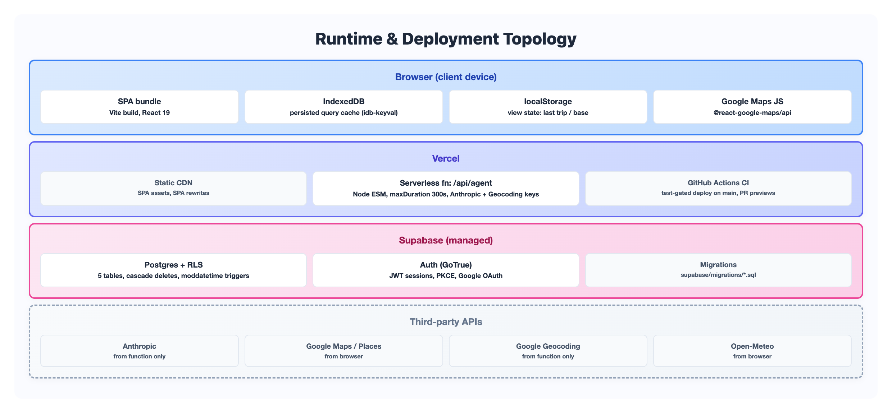
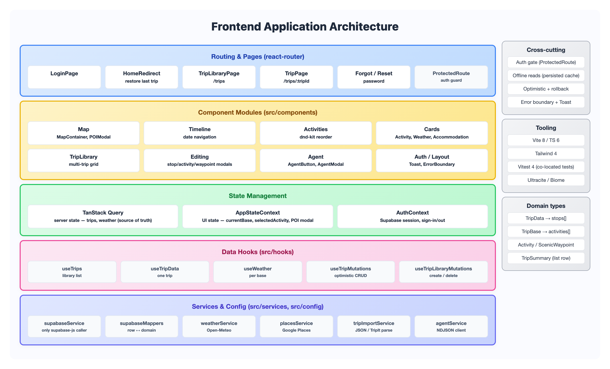
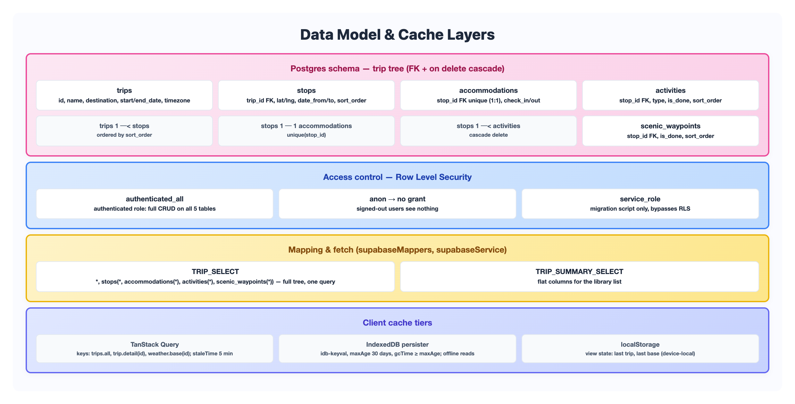
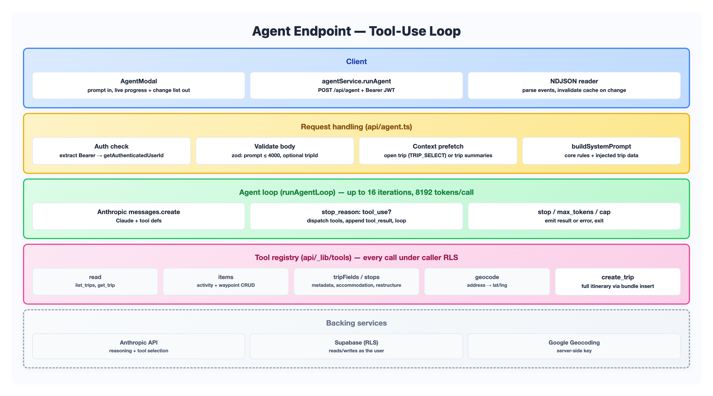

# Wanderlog Architecture

Interactive map-based travel journal. React 19 + TypeScript SPA on the front, Supabase (Postgres + Auth + RLS) on the back, one Vercel serverless function for the AI agent. This document is the as-built architecture reference.

For the decision history behind each layer, see the phase specs: [Phase 1 design](../specs/phase-1/design_phase-1.md) (map, timeline, activities), [Phase 2 design](../specs/phase-2/design_phase-2.md) (Supabase, TanStack Query, auth, offline), and [Phase 3 design](../specs/phase-3/design_wanderlog-phase-3.md) (the agent endpoint). The [spec index](../specs/index.md) is the full map.

All diagrams below use one visual style (Ocean Teal) so tiers keep the same color meaning across every view: teal = user/client, cyan = application, blue = intelligence, sky = data, indigo = infrastructure, dashed = external services. Each diagram is a PNG; the source render lives beside it in [`assets/`](assets/) as a standalone HTML file (click any diagram to open it).

---

## 1. System Context

Who uses Wanderlog and what it talks to. The audience is a small family sharing a set of trips; every authenticated user sees the same trip data (shared-tenant, gated by auth). The SPA holds no secrets beyond public client keys; the Anthropic key lives only in the serverless function.

**Trust boundaries.** The browser holds the Supabase URL + anon key and the Google Maps browser key (both public, restricted by RLS and referrer). The Anthropic key and Google Geocoding key never reach the client; they live in Vercel function env only. Every Postgres read/write runs under the caller's JWT, so RLS is the real gate — the anon role gets no table grants.

---

## 2. Runtime & Deployment

Three runtime tiers: the browser, Vercel (static hosting plus one function), and Supabase. The SPA is a static bundle served from Vercel's CDN; `vercel.json` rewrites every non-`/api/` path to `index.html` for client-side routing, and routes `/api/agent` to the serverless function (`maxDuration: 300s`, sized for a full agent run).

**Connection paths.** Browser → Supabase directly (`supabase-js` over the anon key + user JWT). Browser → `/api/agent` with a bearer JWT for agent runs. The function → Supabase under that same JWT (RLS-scoped), → Anthropic, → Google Geocoding. Weather and the interactive map talk browser-to-provider directly; neither needs the backend.

---

## 3. Frontend Application Architecture

The front end keeps a hard split: **server state lives in TanStack Query, UI state lives in a Context reducer.** Trip and weather data are never copied into React state — components read them straight from the query cache. This is the rule to preserve when adding features.

Provider order at the root (`main.tsx`): `PersistQueryClientProvider` → `AuthProvider` → `AppStateProvider` → `App`.

**Read path.** route → `useTripData` / `useTrips` → TanStack Query → `supabaseService` → Supabase; rows map to domain types via `supabaseMappers`.

**Write path.** component → mutation hook → optimistic cache patch (`onMutate` snapshots + patches) → `supabaseService` → Supabase → invalidate on settle; `onError` restores the snapshot. Follow this shape for any new write.

**Boundary rule.** `supabaseService` is the only module importing `supabase-js`. Everything else goes through it, so the data access surface stays in one file.

---

## 4. Data Architecture

One trip is a tree: a **trip** has ordered **stops**; each stop has at most one **accommodation** and many **activities** and **scenic_waypoints**. Deletes cascade down the tree. A single nested select (`TRIP_SELECT`) pulls the whole tree in one round trip; the library list uses a lighter `TRIP_SUMMARY_SELECT`.

Done-status is a canonical `is_done` column shared by all users — there is no per-user modification concept. `updated_at` is maintained by a `moddatetime` trigger (last-write-wins).

**Migration path.** Legacy trip JSON (`local/trip-data/`, `YYYYMM_LOCATION_trip-plan.json`) imports via `pnpm migrate:supabase` using the service-role key. Schema and RLS live in `supabase/migrations/*.sql` (Supabase CLI). Firebase/Firestore was the Phase 1 backend; it was decommissioned at the end of Phase 2 (final export in `local/firestore-export/`).

**Cache invariant.** `gcTime` must stay ≥ the persister `maxAge` (30 days) or the restored cache is dropped. Bump the `buster` string in `main.tsx` on any breaking cache-shape change.

---

## 5. AI Agent Architecture

The agent is the only server-side code. `/api/agent` runs an Anthropic tool-use loop: the model reads and writes trip data through a fixed tool registry, and every DB call runs under the caller's JWT (same RLS as the SPA). The write tools mirror the client's CRUD surface, so the agent can't do anything a user couldn't do by hand.

Responses stream as NDJSON by default (one JSON event per line: `progress`, `change`, `error`, `result`); an `Accept: application/json` request gets a single buffered result instead.

**Loop control.** Each iteration calls Claude; if the response asks for tools, the handler runs them, emits a `change` event per mutation, feeds `tool_result` blocks back, and loops. It stops on a normal finish, on `max_tokens` (truncated tool calls are unsafe to run), or at the 16-iteration cap. The `create_trip` tool reuses the same bundle-insert pipeline as file import, so agent-created and imported trips are structurally identical.

**Guardrails.** The system prompt forbids acting on anything but trip data, forbids inventing ids/coordinates, and forbids deletes as a side effect. Trip content is treated as data, not instructions (prompt-injection defense). There is no undo — writes commit immediately, which is why the modal surfaces the change list.

**Contract types.** The event shapes (`AgentEvent`, `AgentChangeEvent`, `AgentResultEvent`) are shared between client and server in [src/types/agent.ts](../../src/types/agent.ts), keeping the NDJSON wire format typed on both ends.

---

## Diagram Sources

Each diagram is generated from a standalone HTML file (Ocean Teal style) and captured to PNG. Edit the HTML, re-screenshot, and the doc picks up the new image.

| Diagram | Image | Source |
|---|---|---|
| System Context | [01-system-context.png](assets/01-system-context.png) | [01-system-context.html](assets/01-system-context.html) |
| Runtime & Deployment | [02-runtime-deployment.png](assets/02-runtime-deployment.png) | [02-runtime-deployment.html](assets/02-runtime-deployment.html) |
| Frontend Application | [03-frontend-application.png](assets/03-frontend-application.png) | [03-frontend-application.html](assets/03-frontend-application.html) |
| Data Architecture | [04-data-architecture.png](assets/04-data-architecture.png) | [04-data-architecture.html](assets/04-data-architecture.html) |
| AI Agent | [05-agent-architecture.png](assets/05-agent-architecture.png) | [05-agent-architecture.html](assets/05-agent-architecture.html) |

---

## Key References

| Concern | Where |
|---|---|
| Root providers & cache persister | [src/main.tsx](../../src/main.tsx), [src/lib/queryClient.ts](../../src/lib/queryClient.ts) |
| Routing | [src/App.tsx](../../src/App.tsx) |
| Data access (only supabase-js caller) | [src/services/supabaseService.ts](../../src/services/supabaseService.ts) |
| Row ↔ domain mapping + selects | [src/services/supabaseMappers.ts](../../src/services/supabaseMappers.ts) |
| Optimistic mutations | [src/hooks/useTripMutations.ts](../../src/hooks/useTripMutations.ts), [src/hooks/useTripLibraryMutations.ts](../../src/hooks/useTripLibraryMutations.ts) |
| UI state / Auth | [src/contexts/AppStateContext.tsx](../../src/contexts/AppStateContext.tsx), [src/contexts/AuthContext.tsx](../../src/contexts/AuthContext.tsx) |
| DB schema + RLS | [supabase/migrations/](../../supabase/migrations/) |
| Agent endpoint | [api/agent.ts](../../api/agent.ts), [api/_lib/loop.ts](../../api/_lib/loop.ts), [api/_lib/tools/](../../api/_lib/tools/) |
| Domain types | [src/types/trip.ts](../../src/types/trip.ts), [src/types/agent.ts](../../src/types/agent.ts) |
| Deployment config | [vercel.json](../../vercel.json) |
