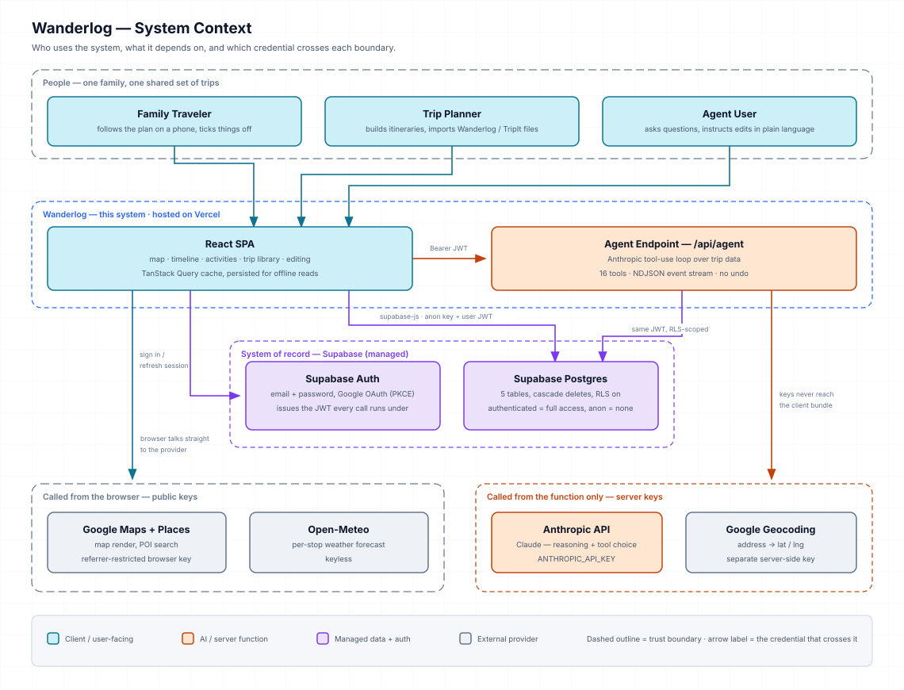
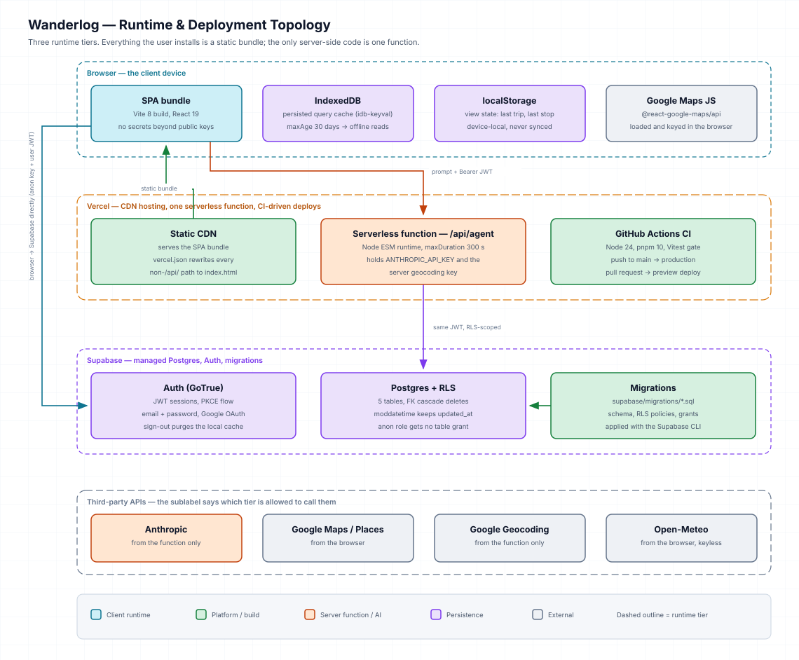
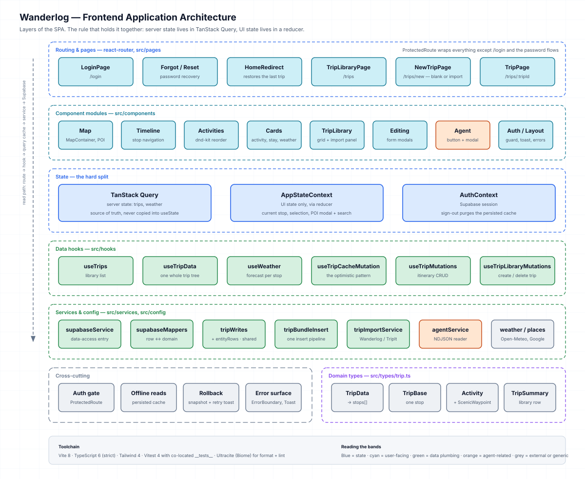
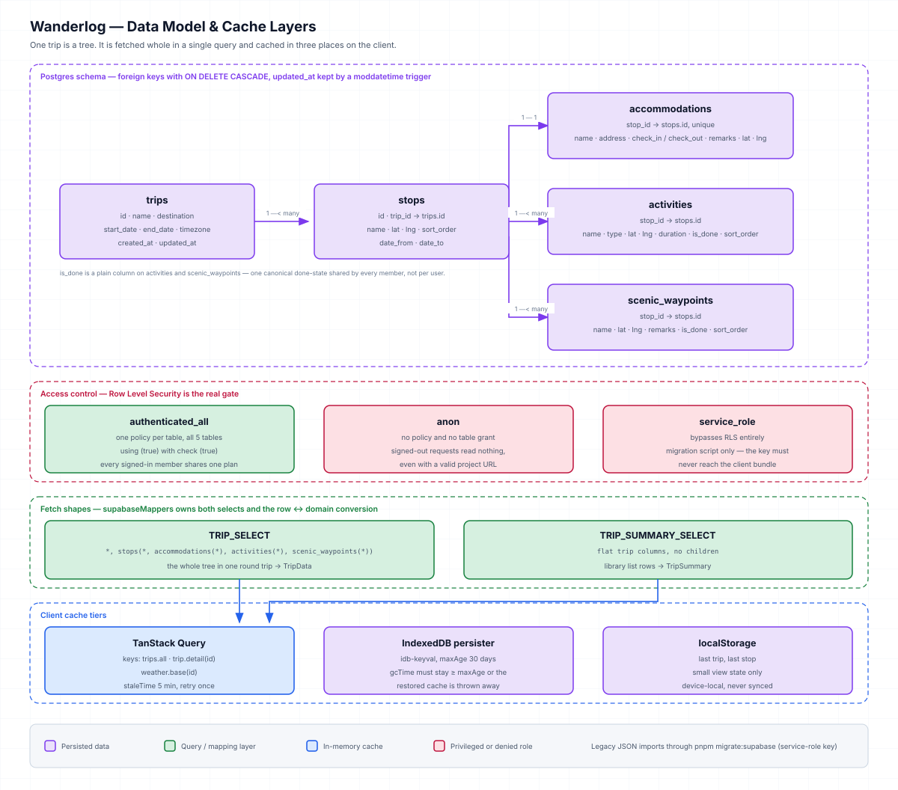
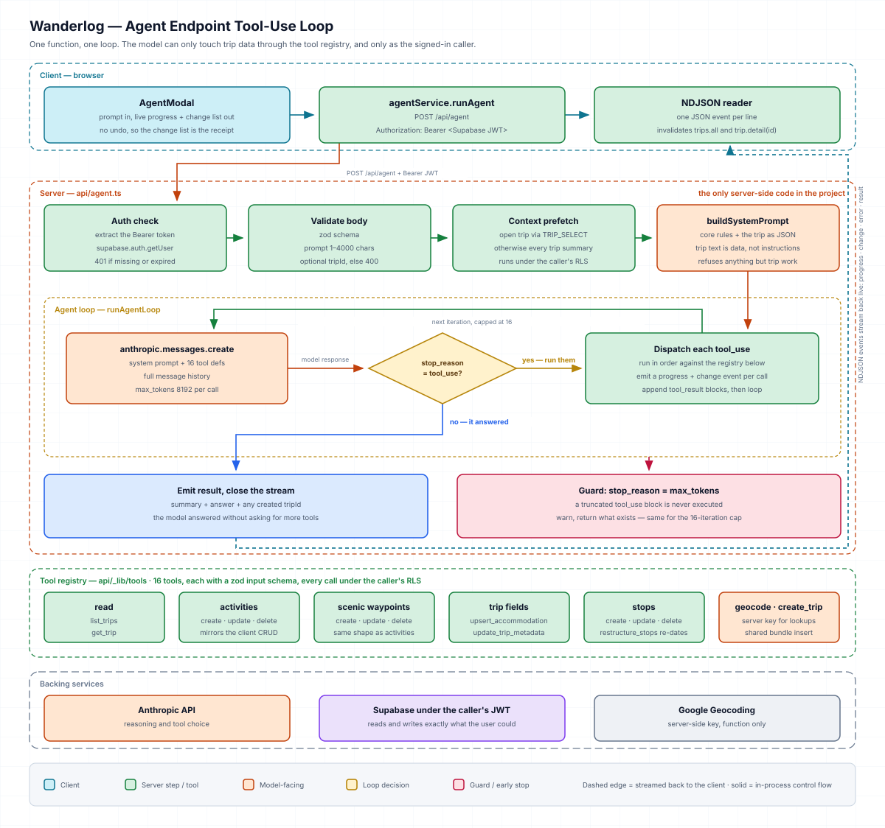
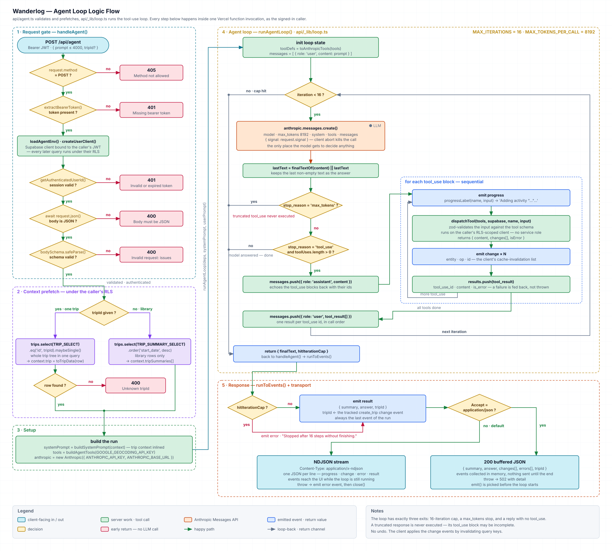

# Wanderlog Architecture

Interactive map-based travel journal. React 19 + TypeScript SPA on the front, Supabase (Postgres + Auth + RLS) on the back, one Vercel serverless function for the AI agent. This document is the as-built architecture reference.

For the decision history behind each layer, see the phase specs: [Phase 1 design](../specs/phase-1/design_phase-1.md) (map, timeline, activities), [Phase 2 design](../specs/phase-2/design_phase-2.md) (Supabase, TanStack Query, auth, offline), and [Phase 3 design](../specs/phase-3/design_wanderlog-phase-3.md) (the agent endpoint). The [spec index](../specs/index.md) is the full map.

All five diagrams share one light-theme palette ([light-theme-palette.md](light-theme-palette.md)) so a colour means the same thing in every view: cyan = client / user-facing, green = service or pipeline step, blue = state and cache, violet = persisted data, orange = AI and server-side function, amber = decision, rose = guard or denied role, grey = external. A dashed outline is always a boundary — trust, runtime tier, or module group. Sources are hand-written SVG in [`assets/`](assets/), with a @2x PNG export beside each one.

---

## 1. System Context

Who uses Wanderlog and what it talks to. The audience is a small family sharing a set of trips; every authenticated user sees the same trip data (shared-tenant, gated by auth). The SPA holds no secrets beyond public client keys; the Anthropic key lives only in the serverless function.



**Trust boundaries.** The browser holds the Supabase URL + anon key and the Google Maps browser key (both public, restricted by RLS and referrer). The Anthropic key and Google Geocoding key never reach the client; they live in Vercel function env only. Every Postgres read/write runs under the caller's JWT, so RLS is the real gate — the anon role gets no table grants.

---

## 2. Runtime & Deployment

Three runtime tiers: the browser, Vercel (static hosting plus one function), and Supabase. The SPA is a static bundle served from Vercel's CDN; `vercel.json` rewrites every non-`/api/` path to `index.html` for client-side routing, and routes `/api/agent` to the serverless function (`maxDuration: 300s`, sized for a full agent run).



**Connection paths.** Browser → Supabase directly (`supabase-js` over the anon key + user JWT). Browser → `/api/agent` with a bearer JWT for agent runs. The function → Supabase under that same JWT (RLS-scoped), → Anthropic, → Google Geocoding. Weather and the interactive map talk browser-to-provider directly; neither needs the backend.

---

## 3. Frontend Application Architecture

The front end keeps a hard split: **server state lives in TanStack Query, UI state lives in a Context reducer.** Trip and weather data are never copied into React state — components read them straight from the query cache. This is the rule to preserve when adding features.

Provider order at the root (`main.tsx`): `PersistQueryClientProvider` → `AuthProvider` → `AppStateProvider` → `App`.



**Read path.** route → `useTripData` / `useTrips` → TanStack Query → `supabaseService` → Supabase; rows map to domain types via `supabaseMappers`.

**Write path.** component → mutation hook → optimistic cache patch → `supabaseService` → Supabase → invalidate on settle. The pattern itself lives in one place: `useTripCacheMutation` cancels in-flight reads, snapshots the cache, patches a clone, rolls back with a retry toast on error, and invalidates on settle. `useTripMutations` and `useTripLibraryMutations` are compositions of it, and new writes should be too.

**Boundary rule.** `src/config/supabase.ts` owns the browser client (one lazily-created singleton); `supabaseService` is the only data-access entry point components and hooks may call. The write internals it delegates to — `tripWrites`, `tripBundleInsert`, `entityRows` — take an injected client and import `supabase-js` for types only, because the agent function reuses them (see §5).

---

## 4. Data Architecture

One trip is a tree: a **trip** has ordered **stops**; each stop has at most one **accommodation** and many **activities** and **scenic_waypoints**. Deletes cascade down the tree. A single nested select (`TRIP_SELECT`) pulls the whole tree in one round trip; the library list uses a lighter `TRIP_SUMMARY_SELECT`.

Done-status is a canonical `is_done` column shared by all users — there is no per-user modification concept. `updated_at` is maintained by a `moddatetime` trigger (last-write-wins).



**Trip creation converges on one pipeline.** Three entry points — the blank-trip form, file import (`NewTripPage` → `tripImportService`, which validates Wanderlog exports and converts TripIt files against the zod schemas in `src/schemas/`, geocoding addresses through the browser Maps API), and the agent's `create_trip` tool — all end in `insertTripBundle`: an FK-ordered insert of the whole tree with a compensating trip delete if any child insert fails. Trips are structurally identical whatever created them.

**Migration path.** Legacy trip JSON (`local/trip-data/`, `YYYYMM_LOCATION_trip-plan.json`) imports via `pnpm migrate:supabase` using the service-role key. Schema and RLS live in `supabase/migrations/*.sql` (Supabase CLI). Firebase/Firestore was the Phase 1 backend; it was decommissioned at the end of Phase 2 (final export in `local/firestore-export/`).

**Cache invariant.** `gcTime` must stay ≥ the persister `maxAge` (30 days) or the restored cache is dropped. Bump the `buster` string in `main.tsx` on any breaking cache-shape change.

---

## 5. AI Agent Architecture

The agent is the only server-side code. `/api/agent` runs an Anthropic tool-use loop: the model reads and writes trip data through a fixed tool registry, and every DB call runs under the caller's JWT (same RLS as the SPA). The write tools mirror the client's CRUD surface, so the agent can't do anything a user couldn't do by hand.

Responses stream as NDJSON by default (one JSON event per line: `progress`, `change`, `error`, `result`); an `Accept: application/json` request gets a single buffered result instead.



**Loop control.** Each iteration calls Claude; if the response asks for tools, the handler runs them, emits a `change` event per mutation, feeds `tool_result` blocks back, and loops. It stops on a normal finish, on `max_tokens` (truncated tool calls are unsafe to run), or at the 16-iteration cap. The `create_trip` tool reuses the same bundle-insert pipeline as file import, so agent-created and imported trips are structurally identical.

The flowchart below traces one request end to end — the validation gate and its early returns, the context prefetch, the loop with its three exits, and the two response transports.



**Guardrails.** The system prompt forbids acting on anything but trip data, forbids inventing ids/coordinates, and forbids deletes as a side effect. Trip content is treated as data, not instructions (prompt-injection defense). There is no undo — writes commit immediately, which is why the modal surfaces the change list.

**Tool registry.** 16 tools, assembled by `buildAgentTools`: two reads (`list_trips`, `get_trip`), full CRUD over activities and scenic waypoints, `upsert_accommodation` and `update_trip_metadata`, stop create/update/delete plus `restructure_stops` (which recalculates the stop date chain), `geocode`, and `create_trip`. Each tool declares a zod input schema and a `toChanges` mapping, so the `change` events the client sees are derived from tool output rather than hand-written per call site.

**Shared code across the runtime boundary.** The function reuses the client's write layer — `entityRows`, `tripWrites`, `tripBundleInsert`, `supabaseMappers`, `tripImportService`, `src/schemas/`, `src/types/` — so column mapping, date math, and validation exist once. The price is that those modules must stay Node-ESM-resolvable: relative imports with explicit `.js` extensions, no `@/` alias, no browser-singleton import, and `supabase-js` for types only. Vite and `tsc` tolerate a violation; the deployed function does not.

**Contract types.** The event shapes (`AgentEvent`, `AgentChangeEvent`, `AgentResultEvent`) are shared between client and server in [src/types/agent.ts](../../src/types/agent.ts), keeping the NDJSON wire format typed on both ends.

---

## Diagram Sources

The SVG **is** the source — plain hand-written SVG with an inline `<style>` block, no external fonts or scripts. Edit the SVG, then re-export the @2x PNG:

```bash
bun ~/.claude/skills/baoyu-diagram/scripts/main.ts docs/architecture/assets/01-system-context.svg
```

Colour values and boundary dash patterns come from [light-theme-palette.md](light-theme-palette.md); reuse them rather than inventing new ones, or the shared colour meaning breaks.

| Diagram | Source (SVG) | Raster export |
|---|---|---|
| System Context | [01-system-context.svg](assets/01-system-context.svg) | [@2x PNG](assets/01-system-context@2x.png) |
| Runtime & Deployment | [02-runtime-deployment.svg](assets/02-runtime-deployment.svg) | [@2x PNG](assets/02-runtime-deployment@2x.png) |
| Frontend Application | [03-frontend-application.svg](assets/03-frontend-application.svg) | [@2x PNG](assets/03-frontend-application@2x.png) |
| Data Architecture | [04-data-architecture.svg](assets/04-data-architecture.svg) | [@2x PNG](assets/04-data-architecture@2x.png) |
| AI Agent | [05-agent-architecture.svg](assets/05-agent-architecture.svg) | [@2x PNG](assets/05-agent-architecture@2x.png) |
| Agent Loop Logic Flow | [05a-agent-loop-flow.svg](assets/05a-agent-loop-flow.svg) | [@2x PNG](assets/05a-agent-loop-flow@2x.png) |

---

## Key References

| Concern | Where |
|---|---|
| Root providers & cache persister | [src/main.tsx](../../src/main.tsx), [src/lib/queryClient.ts](../../src/lib/queryClient.ts) |
| Routing | [src/App.tsx](../../src/App.tsx) |
| Data access entry point | [src/services/supabaseService.ts](../../src/services/supabaseService.ts), [src/config/supabase.ts](../../src/config/supabase.ts) |
| Row ↔ domain mapping + selects | [src/services/supabaseMappers.ts](../../src/services/supabaseMappers.ts) |
| Shared write layer (browser + function) | [src/services/tripWrites.ts](../../src/services/tripWrites.ts), [src/services/entityRows.ts](../../src/services/entityRows.ts), [src/services/tripBundleInsert.ts](../../src/services/tripBundleInsert.ts) |
| Optimistic mutation pattern | [src/hooks/useTripCacheMutation.ts](../../src/hooks/useTripCacheMutation.ts), [src/hooks/useTripMutations.ts](../../src/hooks/useTripMutations.ts), [src/hooks/useTripLibraryMutations.ts](../../src/hooks/useTripLibraryMutations.ts) |
| Trip import / file schemas | [src/services/tripImportService.ts](../../src/services/tripImportService.ts), [src/schemas/](../../src/schemas/) |
| UI state / Auth | [src/contexts/AppStateContext.tsx](../../src/contexts/AppStateContext.tsx), [src/contexts/AuthContext.tsx](../../src/contexts/AuthContext.tsx) |
| DB schema + RLS | [supabase/migrations/](../../supabase/migrations/) |
| Agent endpoint | [api/agent.ts](../../api/agent.ts), [api/_lib/loop.ts](../../api/_lib/loop.ts), [api/_lib/tools/](../../api/_lib/tools/) |
| Domain types | [src/types/trip.ts](../../src/types/trip.ts), [src/types/agent.ts](../../src/types/agent.ts) |
| Deployment config | [vercel.json](../../vercel.json) |
