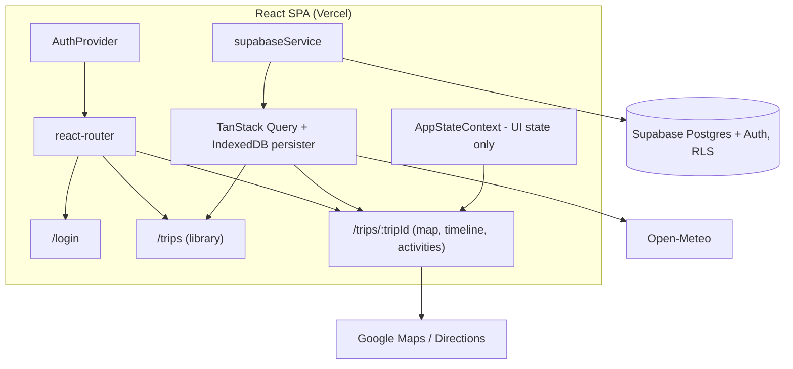

# Wanderlog Phase 2 - Design Document

Design for [requirements_wanderlog-phase-2.md](requirements_wanderlog-phase-2.md): Supabase backend, auth gate, trip library, itinerary editing, offline read, Vercel hosting. Existing UI behavior carries over per [design_travel-journal.md](design_travel-journal.md) except where amended here.

## Design Decisions

Settled during design review, in addition to the Scope Decisions in the requirements doc.

| Decision | Choice | Rationale |
|----------|--------|-----------|
| Activity done-status | Canonical column (`is_done`), shared by all family members | Matches "did we do this" semantics and Req 4.3's canonical ordering. Removes the `user_modifications` concept entirely. |
| Server state | TanStack Query on top of supabase-js | Optimistic mutations with rollback and retry (Req 4.8) are native. `persistQueryClient` + IndexedDB persister doubles as the offline read cache (Req 5). |
| Weather key proxy | Dropped | Open-Meteo is keyless. Requirement 7 amended; revisit if a keyed API is ever added. |
| Weather cache | Client-side persisted query cache, 6h staleness | Req 1.5 amended. A Supabase cache table would add a round trip to dedupe calls to a free, keyless API. |
| Navigation | react-router: `/login`, `/trips`, `/trips/:tripId` | Bookmarkable trips, working back button, clean auth redirects. Vercel SPA rewrites make it free. |
| Editing UX | Modal form per item (shadcn Dialog), explicit Save/Cancel | One reusable pattern for all entity types; a clear optimistic-save point; works on mobile. |
| Primary keys | Text PKs preserving existing JSON ids; client-generated UUIDs for new rows | Migration becomes a natural-key upsert, idempotent by construction (Req 1.2). |
| Rollback (Req 8.2) | Redeploy previous deployment | Spec allows config or deployment rollback. A runtime backend flag would double the data-layer surface for a one-week window. |
| Toolchain | New Milestone 0 upgrades frameworks/toolchain before any Phase 2 code | Avoids doing major upgrades mid-migration. Firebase SDK excluded; it is decommissioned within this phase. |
| Trip creation (M3.5) | File import only: drag-n-drop JSON (Wanderlog or TripIt export) into the create modal | The family's real flow starts from an existing plan file; an empty trip offers nothing the M4 editors cannot add to an imported one. Req 3.5 amended. |
| Import validation | zod schemas at the import boundary | Structured field-path errors for the UI without hand-rolled type narrowing; one schema is the source of truth for "valid trip file". `validationUtils.ts` untouched (serves other callers). |
| Import ids | Fresh UUIDs minted for every imported row | Text PKs are global; natural ids from files collide on re-import. Re-import creates an independent copy, never overwrites. |
| TripIt coordinates | Geocode lodging addresses at import via Maps Geocoder | TripIt exports carry no lat/lng; `stops.lat/lng` are NOT NULL. Geocode failure blocks the import as a validation error. |
| Password reset + invite landing (Req 2.8, 2.9) | One public `/reset-password` page for both; `updateUser({ password })` sets the password | Recovery and invitation both deliver a PKCE code that `detectSessionInUrl` exchanges into a session; the only difference is who initiates (user vs. dashboard). A single landing page and one `updatePassword` path serve both — no per-flow UI. Invite redirect is dashboard-configured, matching how Google OAuth was set up. |

## Architecture



Responsibilities:

- **supabaseService** - the only module importing supabase-js. Fetch/mutate functions plus row-to-domain mappers.
- **TanStack Query** - server state: trip data, trip list, weather. Cache persisted to IndexedDB (`idb-keyval` persister, maxAge 30 days) for offline reads.
- **AppStateContext** - slims to UI state: `currentBase`, `selectedActivity`, POI modal/search. Trip data, weather, loading/error move to the query cache. `TOGGLE_ACTIVITY_DONE`, `REORDER_ACTIVITIES`, `SET_WEATHER_DATA` leave the reducer and become mutations/queries.
- **AuthProvider** - wraps the router; session from `supabase.auth.getSession()` + `onAuthStateChange`.
- Legacy layers removed when replacements land: `firebaseService`, `storageService` dual-write, `useAppState.ts`, `useLocalStorage.ts` persistence path, dormant Firestore offline code.

Domain types (`TripData`, `TripBase`, `Activity`, `ScenicWaypoint`) are unchanged. Components, the export feature, and route calculation keep consuming the same shapes (M1 parity, Req 1.3).

## Database Schema

Five tables, in `supabase/migrations/*.sql`, applied via Supabase CLI.

```sql
create table trips (
  id          text primary key,
  name        text not null,
  description text,
  destination text,
  start_date  date not null,
  end_date    date not null,
  timezone    text not null,
  created_at  timestamptz not null default now(),
  updated_at  timestamptz not null default now()
);

create table stops (
  id          text primary key,
  trip_id     text not null references trips(id) on delete cascade,
  name        text not null,
  date_from   date not null,
  date_to     date not null,
  lat         double precision not null,
  lng         double precision not null,
  duration_days integer,
  travel_time_from_previous text,
  sort_order  integer not null,
  created_at  timestamptz not null default now(),
  updated_at  timestamptz not null default now()
);

create table accommodations (
  id          text primary key,
  stop_id     text not null unique references stops(id) on delete cascade,
  name        text not null,
  address     text,
  check_in    text,   -- 'YYYY-MM-DD HH:mm' local to trip timezone
  check_out   text,
  confirmation text,
  url         text,
  remarks     text,               -- added by M4 migration (Req 4.4)
  lat         double precision,   -- added by M4 migration (Req 4.4)
  lng         double precision,   -- added by M4 migration (Req 4.4)
  thumbnail_url text,
  google_place_id text,
  created_at  timestamptz not null default now(),
  updated_at  timestamptz not null default now()
);

create table activities (
  id          text primary key,
  stop_id     text not null references stops(id) on delete cascade,
  name        text not null,
  type        text,
  lat         double precision,
  lng         double precision,
  address     text,
  duration    text,
  travel_time_from_accommodation text,
  url         text,
  remarks     text,
  thumbnail_url text,
  google_place_id text,
  sort_order  integer not null,
  is_done     boolean not null default false,
  created_at  timestamptz not null default now(),
  updated_at  timestamptz not null default now()
);

create table scenic_waypoints (
  -- same shape as activities minus type and travel_time_from_accommodation
  id          text primary key,
  stop_id     text not null references stops(id) on delete cascade,
  name        text not null,
  lat         double precision,
  lng         double precision,
  address     text,
  duration    text,
  url         text,
  remarks     text,
  thumbnail_url text,
  google_place_id text,
  sort_order  integer not null,
  is_done     boolean not null default false,
  created_at  timestamptz not null default now(),
  updated_at  timestamptz not null default now()
);
```

Schema notes:

- `trips.start_date/end_date/destination` are stored, not derived from stops: a freshly created trip has no stops yet but must appear in the library with a date range (Req 3.1, 3.5).
- `check_in`/`check_out` stay as local-time text. The trip carries its own timezone; `timestamptz` would shift values on read.
- `is_done` exists on both `activities` and `scenic_waypoints`. Today waypoints share the activity status namespace; the schema separates them.
- `updated_at` maintained by a `moddatetime` trigger on every table - the last-write-wins timestamp (Req 4.9).
- **RLS** (Req 1.6): enabled on every table. `authenticated` role gets full CRUD (`using (true) with check (true)`); `anon` has no policies, so all access is denied. No per-user policies - single family.
- No `user_modifications` and no `weather_cache` table. Device view state (last viewed stop/date, map layer preferences, last selected trip) stays in localStorage.
- **Migration-before-deploy ordering:** every schema migration must be pushed to production (`supabase db push --linked`) before or with the frontend deploy that reads the new columns. PostgREST `select *` silently omits columns that don't exist, so rows come back with those fields `undefined` (not `null`). As defense in depth, the row-to-domain mappers use loose `== null` coordinate guards so a client deployed ahead of its migration degrades gracefully (no location) instead of feeding `{ lat: undefined }` to Google Maps, which throws and takes down the trip page (2026-07-04 production incident).

## Data Layer

**Read path.** One embedded PostgREST query assembles the nested `TripData` shape:

```
trips?select=*,stops(*,accommodations(*),activities(*),scenic_waypoints(*))
```

with `sort_order` ordering on embedded resources. Mappers convert rows to domain types at the service boundary; `useTripData`/`useTrips` are rewritten on `useQuery` with unchanged return shapes.

Query keys:

| Key | Data | Notes |
|-----|------|-------|
| `['trips']` | Trip summaries for the library | |
| `['trip', tripId]` | Full nested `TripData` | |
| `['weather', baseId]` | Open-Meteo response | `staleTime: 6h`; offline shows stale data with `dataUpdatedAt` timestamp (Req 5.4) |

**Mutations.** One hook per operation; each writes only the affected row(s), patches the nested `['trip', tripId]` cache in `onMutate`, rolls back in `onError` with a retry toast (Req 4.8), invalidates in `onSettled`.

| Hook | Writes |
|------|--------|
| `useToggleActivityDone` | `activities.is_done` (also waypoints) |
| `useReorderActivities` | batch `sort_order` update for one stop's activities |
| `useCreateActivity` / `useUpdateActivity` / `useDeleteActivity` | `activities` row |
| `useUpdateAccommodation` | `accommodations` row (upsert) |
| `useUpsertWaypoint` / `useDeleteWaypoint` | `scenic_waypoints` row |
| `useUpdateTrip` | `trips` row |
| `useCreateTrip` / `useDeleteTrip` | `trips` row (delete cascades) |
| Stop CRUD + reorder | `stops` rows; date cascades computed client-side and written as a batch |

## Authentication

- Supabase Auth, email/password. Public sign-up disabled in the dashboard; accounts provisioned manually by the app owner (Req 2.4).
- Google sign-in: enable the provider, configure redirect URLs. supabase-js `detectSessionInUrl` handles the OAuth callback; no dedicated callback route.
- Route guard renders `/login` for unauthenticated users. All queries are `enabled: !!session`, so no trip data is fetched or rendered before sign-in (Req 2.1).
- Session persistence across restarts is the supabase-js default (Req 2.5).
- Sign-out clears the Supabase session, the query cache, and the IndexedDB persist (Req 2.6).

**Password reset and invitation acceptance (Req 2.8, 2.9).** Both flows converge on one public landing page. A recovery/invite email carries a PKCE `?code=` link; the client's `detectSessionInUrl` exchanges it for an active (short-lived) session on landing, and the user then calls `updateUser({ password })` to set a real password.

- `AuthContext.resetPassword(email)` → `resetPasswordForEmail(email, { redirectTo: <origin><BASE_URL>reset-password })`. Entry point: a "Forgot password?" link on `LoginForm` → `/forgot-password` page (email field → confirmation message; no account enumeration in the copy).
- `AuthContext.updatePassword(password)` → `updateUser({ password })`.
- `/reset-password` page (`ResetPasswordPage`) is the shared landing for **both** recovery and invitation. It waits for the code exchange (`isLoading`), shows a "set new password" form once a session exists (Save → `updatePassword` → navigate `/`), and shows an invalid/expired-link message with a "request a new link" path when no session appears.
- `/forgot-password` and `/reset-password` are **public** routes (outside `ProtectedRoute`) — the recovery/invite session does not exist until the code is exchanged on that page, so guarding them would bounce the link to `/login` and drop the `?code=`.
- **Invitations** are issued from the Supabase dashboard ("Invite user", Req 2.4) — no in-app initiation. Dashboard config (like the Google OAuth setup): `<origin>/reset-password` must be in the Auth **Redirect URLs** allowlist, and the invite email template's link must target it, so an invitee lands on the set-password page rather than entering the app password-less.

## Trip Library (`/trips`)

- Lists all trips: name, destination, date range, derived status - `past` / `active` / `upcoming` vs today in the trip's timezone (Req 3.1).
- Ordered by `start_date`; active or next upcoming trip rendered most prominent (Req 3.2).
- Create trip: file-import modal - see Trip Import (M3.5). Blank-trip creation (the original M3 form) is removed per the Req 3.5 amendment.
- Delete trip: confirm dialog; DB cascade removes stops, activities, accommodations, waypoints (Req 3.6).
- Last selected trip id in localStorage; `/` redirects there, else to `/trips` (Req 3.4).
- Existing unwired scaffolding (`useTrips`, `TripCard`, `TripSelectorModal`) reused where it fits, rebuilt small where it does not.

## Trip Import (M3.5)

Trip creation is file import: the create modal accepts a JSON trip data file (drag-and-drop or file picker) and nothing is saved without a file that passes validation (Req 3.5, 3.7-3.9).

**Pipeline** (all client-side):

```
file → JSON.parse → detectFormat → zod validate → convert (TripIt: + geocode) → withFreshIds → buildRows → importTrip
```

New modules:

- `src/schemas/tripFileSchemas.ts` - zod schemas: native trip file (bare `TripData` or the `{exportDate, tripData}` export wrapper) and the TripIt export envelope (only the fields consumed).
- `src/services/tripImportService.ts` - format detection, validation orchestration, TripIt conversion, id regeneration.
- `src/services/geocodingService.ts` - thin wrapper over `google.maps.Geocoder`, injectable for tests. Maps JS is not loaded on `/trips`; the modal lazy-loads it only when a TripIt file needs geocoding.

Format detection: `trip_name` + `stops` (optionally under `tripData`) → native; top-level `trips[]` with `startDate`/`lodging` → TripIt; neither → "Unrecognized file format" error. The TripIt path converts to `TripData` first and then runs the same native zod validation - one gate guards the DB regardless of source.

`withFreshIds` mints UUIDs for the trip and every stop, accommodation, activity, and waypoint, preserving parent-child wiring. Re-importing a file creates an independent copy; no collisions with global text PKs (Req 3.9).

**TripIt → TripData mapping:**

| TripIt | TripData |
|--------|----------|
| `trips[0]` name / startDate / endDate / primaryLocation | Trip name, dates, destination |
| Each `lodging` | One stop: name ← title, dates ← check-in/check-out, coords ← geocode(address); full accommodation (address, parsed check-in/out times, confirmation, booking URL, phone) |
| Each flight | Activity `type: transport` on the stop whose date range contains the flight date, else the nearest stop; name like "SQ346: SIN → ZRH", remarks from departure/arrival text |
| `activities` / `restaurants` / `transport` / `rail` items | Activities with mapped types (defensive; empty in current samples) |

- Timezone: TripIt carries no IANA zone → browser timezone, flagged in the preview; editable once M4 trip-metadata editing lands.
- Zero lodging in the file → validation error "No lodging found" (stops need dates + coords).
- Multiple trips in one file → the first is imported, warning shown in the preview.

**Modal states:** drop zone (rejects non-JSON and files > 5 MB) → processing ("Resolving locations…" while geocoding) → preview (trip name, date range, timezone, destination, stop/activity counts, format badge; Create enabled) or error list (one `path: message` line per issue, scrollable; Create disabled). Dropping another file resets the state.

**Persistence:** `importTrip(tripData)` in `supabaseService` reuses `buildRows`, inserting in FK order: trips → stops → accommodations → activities → scenic_waypoints. Plain inserts, not upserts - ids are fresh by construction. Mid-flight failure triggers a compensation delete of the trip row (cascade removes any inserted children), then rethrows - no half-imported trips. `useImportTrip` invalidates `['trips']` and navigates to the new trip on success; no optimistic update (navigation needs the committed row).

**Error surfaces:**

| Failure | Surface |
|---------|---------|
| Non-JSON, oversized, unparseable | Single error line in the modal |
| Unrecognized format | Error plus supported-formats hint |
| zod validation failures | Full list, `path: message` per issue |
| Geocode failure (TripIt) | Blocking error naming the stop and address |
| Insert failure | Mutation error inline; compensation delete ran |

**Testing:** the sample files (`202606_DaNang` native, both TripIt exports) become trimmed fixtures - schema accept/reject cases, converter pure-function tests with a stubbed geocoder (including Zurich's pre-check-in flight landing on the first stop), `withFreshIds` referential integrity, `importTrip` insert order and compensation delete, modal state tests.

## Itinerary Editing (M4)

- Pencil icon on each card opens a modal form (shadcn Dialog) with explicit Save/Cancel. One generic form pattern parameterized per entity: activity, accommodation, scenic waypoint, trip metadata.
- Add activity reuses the existing POI search flow, now persisting through `useCreateActivity` (today's POI add is memory-only).
- Delete: confirm dialog per item.
- Stop restructuring (last M4 slice): stops editor supporting add, remove, reorder. Date shifts cascade to subsequent stops client-side, written as one batch; timeline and route polylines re-render from updated data (Req 4.7).
- Waypoint edits re-trigger route calculation through the updated waypoint sequence (Req 4.6).

## Offline (Req 5)

- `persistQueryClient` with an IndexedDB persister rehydrates cached queries on startup: cached trips render without connectivity (Req 5.1, 5.2).
- `useOnlineStatus` (navigator.onLine + events): offline shows the existing `OfflineIndicator` banner and disables all edit affordances (Req 4.10).
- Stale weather renders with its timestamp instead of an error (Req 5.4).
- On reconnect React Query refetches automatically; editing re-enables (Req 5.3).

## Migration and Rollback (Req 1.2, 8)

- `scripts/migrate-to-supabase.ts` (service-role key, local env only):
  1. Read `local/trip-data/*_trip-plan.json`.
  2. Overlay current Firestore `user_modifications`: `activityStatus` to `is_done`, `activityOrders` to `sort_order` - no checkmarks lost.
  3. Upsert all rows by natural key. Re-runnable by construction.
- Firestore untouched during M1 (Req 8.1). Rollback = redeploy previous deployment (Req 8.2).
- Parity checklist (Req 1.7) lives in the repo and is walked manually before cutover: map rendering, routes, timeline, activity status, weather, export.
- Before decommission: final Firestore export archived into the repo (Req 8.4); trip JSONs retained (Req 8.3).

## Hosting and CI (Req 6)

- Vercel. Remove `base: '/wanderlog/'` from `vite.config.ts`; `vercel.json` SPA fallback rewrite to `/index.html`.
- Env vars in Vercel project settings: `VITE_SUPABASE_URL`, `VITE_SUPABASE_ANON_KEY`, `VITE_GOOGLE_MAPS_API_KEY` (Req 6.3).
- Deploys go through GitHub Actions, not Vercel Git auto-deploy, so tests gate deployment (Req 6.2): push to `main` runs `pnpm test:run`, then `vercel deploy --prod` with `VERCEL_TOKEN`. PRs get preview deploys the same way.
- After cutover: GH Pages workflow deleted, old URL documented as retired in README (Req 6.4).
- Maps key stays client-side with HTTP referrer restrictions for the Vercel domain + localhost (Req 7).

## Testing

- `supabaseService`: unit tests with a mocked supabase-js client (same pattern as `storageService.test.ts` mocking firebaseService).
- Row-to-domain mappers: pure-function tests. Highest-value coverage; they guard parity.
- Mutation hooks: optimistic update + rollback-on-error tests with React Query test utilities.
- Migration script: run against local Supabase (CLI); verify row counts and spot-check field fidelity.
- Parity checklist (Req 1.7): manual, written, checked into the repo.

## Milestones

M0 and M3.5 were added by amendment; M1-M4 match the original requirements doc.

**M0 - Toolchain.** Upgrade frameworks and toolchain to latest stable before Phase 2 code. Each major bump is its own commit so regressions bisect.

| Cluster | From / To | Notes |
|---------|-----------|-------|
| Tailwind | 3.4 to 4.3 | Biggest one. CSS-first config; custom travel-theme colors move to `@theme` CSS. `npx @tailwindcss/upgrade` does most of it. |
| Vite + plugin-react | 7 to 8, 5 to 6 | Config review. |
| Vitest + coverage/ui, jsdom | 3 to 4, 26 to 29 | Mock/config breaking changes possible; 12 test files to keep green. |
| TypeScript | 5.8 to 6.0 | `tsc -b` surfaces breakages. |
| Ultracite + Biome | 6 to 7, 2.3 to 2.5 | Run `npx ultracite fix`, review diff. |
| Minor/patch sweep | react 19.2, date-fns 4.4, dnd-kit, heroicons, testing-library, etc. | One commit. |
| CI Node | 22 to 24 LTS | `@types/node` aligned to 24. |

Excluded: `firebase` stays at 12.6 (decommissioned within this phase). Verification gate: build green, tests green, manual smoke (map, routes, timeline, drag-reorder, export), one GH Pages deploy to confirm the production build.

**M1 - Foundation.** Supabase project, schema migrations, RLS, `supabaseService` + mappers, migration script run, React Query introduced, `useTripData`/`useTrips` rewritten, context slimmed, toggle-done + reorder as mutations (existing features, so part of parity), minimal email/password login form (RLS blocks anon from day one, so parity verification needs a session; M2 polishes the gate). Firestore untouched. Hosting lands here: Vercel project + CI pipeline, verified on preview URLs. *Verify: parity checklist passes on a Vercel preview.*

**M2 - Auth gate.** Route guards, login page polish, Google sign-in, sign-out with cache clear, session persistence checks. Vercel production cutover + GH Pages retirement. *Verify: unauthenticated access fully blocked; family members sign in.*

**M3 - Trip library.** `/trips` page, derived status, create/delete trip, last-trip restore. Second trip seeded via migration script for verification. *Verify: 2+ trips browsable and selectable.*

**M3.5 - Trip import.** Create-trip modal becomes file import: drag-n-drop JSON, zod validation with error-list UI, TripIt conversion with geocoding, fresh-id import, compensation delete on partial insert failure. *Verify: the DaNang native file and both TripIt samples import and render; invalid files rejected with listed errors.*

**M4 - Itinerary editing.** Three slices: activities CRUD; accommodation + trip metadata; scenic waypoints + stop restructuring. Offline edit-disable lands with the first slice. *Verify: each slice edits and persists round-trip.*

**Post-cutover.** Final Firestore export archived, Firebase deps removed from `package.json`, Firestore decommissioned.

## Requirement Amendments

Applied to [requirements_wanderlog-phase-2.md](requirements_wanderlog-phase-2.md) together with this design:

1. Req 1.4 - user modifications become canonical columns (`is_done`, `sort_order`); device view state stays in localStorage.
2. Req 1.5 - weather cache is client-side (persisted query cache, 6h staleness); no Supabase table.
3. Req 7 - Edge Function weather proxy dropped (Open-Meteo is keyless); Maps key clause kept. Scope Decision "Server-side code" now "None".
4. Milestones - M0 (toolchain) added; five milestones total.
5. Req 3.5 - trip creation is file import (drag-n-drop JSON, Wanderlog or TripIt export); blank-trip creation removed. New Req 3.7-3.9: validation-failure display, TripIt conversion via geocoding, fresh-id imports. Milestone M3.5 added; six milestones total.

## Changelog

- 2026-07-03: Initial design (brainstormed and approved).
- 2026-07-04: Trip Import (M3.5) added: file-only create modal, zod validation pipeline, TripIt conversion with geocoding, fresh-id imports, compensation delete (brainstormed and approved).
- 2026-07-04: Schema doc updated with the M4 `accommodations` columns (`remarks`, `lat`, `lng`); migration-before-deploy ordering rule and schema-drift-tolerant mapper guards added after a production incident (see plan_p2m4 Task 6 post-ship fix).
- 2026-07-04: Authentication section extended with password reset and invitation acceptance (Req 2.8, 2.9): `resetPassword`/`updatePassword` on `AuthContext`, public `/forgot-password` + `/reset-password` routes, one shared landing page for both flows, and the dashboard Redirect-URL / invite-template config. Design decision row added. Tracked in [plan_p2m2_auth-gate.md](plan_p2m2_auth-gate.md) Task 9.
