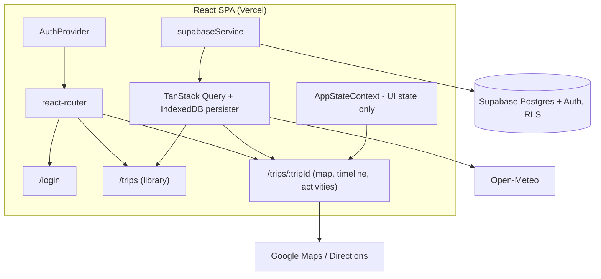

# Wanderlog Phase 2 - Design Document

Design for [requirements_wanderlog-phase-2.md](requirements_wanderlog-phase-2.md): Supabase backend, auth gate, trip library, itinerary editing, offline read, Vercel hosting. Existing UI behavior carries over per [design_travel-journal.md](design_travel-journal.md) except where amended here.

## Design Decisions

Settled during design review, in addition to the Scope Decisions in the requirements doc.

| Decision | Choice | Rationale |
|----------|--------|-----------|
| Activity done-status | Canonical column (`is_done`), shared by all family members | Matches "did we do this" semantics and Req 4.3's canonical ordering. Removes the `user_modifications` concept entirely. |
| Server state | TanStack Query on top of supabase-js | Optimistic mutations with rollback and retry (Req 4.8) are native. `persistQueryClient` + IndexedDB persister doubles as the offline read cache (Req 5). |
| Weather key proxy | Dropped | Open-Meteo is keyless. Requirement 7 amended; revisit if a keyed API is ever added. |
| Weather cache | Client-side persisted query cache, 6h staleness | Req 1.5 amended. A Supabase cache table would add a round trip to dedupe calls to a free, keyless API. |
| Navigation | react-router: `/login`, `/trips`, `/trips/:tripId` | Bookmarkable trips, working back button, clean auth redirects. Vercel SPA rewrites make it free. |
| Editing UX | Modal form per item (shadcn Dialog), explicit Save/Cancel | One reusable pattern for all entity types; a clear optimistic-save point; works on mobile. |
| Primary keys | Text PKs preserving existing JSON ids; client-generated UUIDs for new rows | Migration becomes a natural-key upsert, idempotent by construction (Req 1.2). |
| Rollback (Req 8.2) | Redeploy previous deployment | Spec allows config or deployment rollback. A runtime backend flag would double the data-layer surface for a one-week window. |
| Toolchain | New Milestone 0 upgrades frameworks/toolchain before any Phase 2 code | Avoids doing major upgrades mid-migration. Firebase SDK excluded; it is decommissioned within this phase. |

## Architecture



Responsibilities:

- **supabaseService** - the only module importing supabase-js. Fetch/mutate functions plus row-to-domain mappers.
- **TanStack Query** - server state: trip data, trip list, weather. Cache persisted to IndexedDB (`idb-keyval` persister, maxAge 30 days) for offline reads.
- **AppStateContext** - slims to UI state: `currentBase`, `selectedActivity`, POI modal/search. Trip data, weather, loading/error move to the query cache. `TOGGLE_ACTIVITY_DONE`, `REORDER_ACTIVITIES`, `SET_WEATHER_DATA` leave the reducer and become mutations/queries.
- **AuthProvider** - wraps the router; session from `supabase.auth.getSession()` + `onAuthStateChange`.
- Legacy layers removed when replacements land: `firebaseService`, `storageService` dual-write, `useAppState.ts`, `useLocalStorage.ts` persistence path, dormant Firestore offline code.

Domain types (`TripData`, `TripBase`, `Activity`, `ScenicWaypoint`) are unchanged. Components, the export feature, and route calculation keep consuming the same shapes (M1 parity, Req 1.3).

## Database Schema

Five tables, in `supabase/migrations/*.sql`, applied via Supabase CLI.

```sql
create table trips (
  id          text primary key,
  name        text not null,
  description text,
  destination text,
  start_date  date not null,
  end_date    date not null,
  timezone    text not null,
  created_at  timestamptz not null default now(),
  updated_at  timestamptz not null default now()
);

create table stops (
  id          text primary key,
  trip_id     text not null references trips(id) on delete cascade,
  name        text not null,
  date_from   date not null,
  date_to     date not null,
  lat         double precision not null,
  lng         double precision not null,
  duration_days integer,
  travel_time_from_previous text,
  sort_order  integer not null,
  created_at  timestamptz not null default now(),
  updated_at  timestamptz not null default now()
);

create table accommodations (
  id          text primary key,
  stop_id     text not null unique references stops(id) on delete cascade,
  name        text not null,
  address     text,
  check_in    text,   -- 'YYYY-MM-DD HH:mm' local to trip timezone
  check_out   text,
  confirmation text,
  url         text,
  thumbnail_url text,
  google_place_id text,
  created_at  timestamptz not null default now(),
  updated_at  timestamptz not null default now()
);

create table activities (
  id          text primary key,
  stop_id     text not null references stops(id) on delete cascade,
  name        text not null,
  type        text,
  lat         double precision,
  lng         double precision,
  address     text,
  duration    text,
  travel_time_from_accommodation text,
  url         text,
  remarks     text,
  thumbnail_url text,
  google_place_id text,
  sort_order  integer not null,
  is_done     boolean not null default false,
  created_at  timestamptz not null default now(),
  updated_at  timestamptz not null default now()
);

create table scenic_waypoints (
  -- same shape as activities minus type and travel_time_from_accommodation
  id          text primary key,
  stop_id     text not null references stops(id) on delete cascade,
  name        text not null,
  lat         double precision,
  lng         double precision,
  address     text,
  duration    text,
  url         text,
  remarks     text,
  thumbnail_url text,
  google_place_id text,
  sort_order  integer not null,
  is_done     boolean not null default false,
  created_at  timestamptz not null default now(),
  updated_at  timestamptz not null default now()
);
```

Schema notes:

- `trips.start_date/end_date/destination` are stored, not derived from stops: a freshly created trip has no stops yet but must appear in the library with a date range (Req 3.1, 3.5).
- `check_in`/`check_out` stay as local-time text. The trip carries its own timezone; `timestamptz` would shift values on read.
- `is_done` exists on both `activities` and `scenic_waypoints`. Today waypoints share the activity status namespace; the schema separates them.
- `updated_at` maintained by a `moddatetime` trigger on every table - the last-write-wins timestamp (Req 4.9).
- **RLS** (Req 1.6): enabled on every table. `authenticated` role gets full CRUD (`using (true) with check (true)`); `anon` has no policies, so all access is denied. No per-user policies - single family.
- No `user_modifications` and no `weather_cache` table. Device view state (last viewed stop/date, map layer preferences, last selected trip) stays in localStorage.

## Data Layer

**Read path.** One embedded PostgREST query assembles the nested `TripData` shape:

```
trips?select=*,stops(*,accommodations(*),activities(*),scenic_waypoints(*))
```

with `sort_order` ordering on embedded resources. Mappers convert rows to domain types at the service boundary; `useTripData`/`useTrips` are rewritten on `useQuery` with unchanged return shapes.

Query keys:

| Key | Data | Notes |
|-----|------|-------|
| `['trips']` | Trip summaries for the library | |
| `['trip', tripId]` | Full nested `TripData` | |
| `['weather', baseId]` | Open-Meteo response | `staleTime: 6h`; offline shows stale data with `dataUpdatedAt` timestamp (Req 5.4) |

**Mutations.** One hook per operation; each writes only the affected row(s), patches the nested `['trip', tripId]` cache in `onMutate`, rolls back in `onError` with a retry toast (Req 4.8), invalidates in `onSettled`.

| Hook | Writes |
|------|--------|
| `useToggleActivityDone` | `activities.is_done` (also waypoints) |
| `useReorderActivities` | batch `sort_order` update for one stop's activities |
| `useCreateActivity` / `useUpdateActivity` / `useDeleteActivity` | `activities` row |
| `useUpdateAccommodation` | `accommodations` row (upsert) |
| `useUpsertWaypoint` / `useDeleteWaypoint` | `scenic_waypoints` row |
| `useUpdateTrip` | `trips` row |
| `useCreateTrip` / `useDeleteTrip` | `trips` row (delete cascades) |
| Stop CRUD + reorder | `stops` rows; date cascades computed client-side and written as a batch |

## Authentication

- Supabase Auth, email/password. Public sign-up disabled in the dashboard; accounts provisioned manually by the app owner (Req 2.4).
- Google sign-in: enable the provider, configure redirect URLs. supabase-js `detectSessionInUrl` handles the OAuth callback; no dedicated callback route.
- Route guard renders `/login` for unauthenticated users. All queries are `enabled: !!session`, so no trip data is fetched or rendered before sign-in (Req 2.1).
- Session persistence across restarts is the supabase-js default (Req 2.5).
- Sign-out clears the Supabase session, the query cache, and the IndexedDB persist (Req 2.6).

## Trip Library (`/trips`)

- Lists all trips: name, destination, date range, derived status - `past` / `active` / `upcoming` vs today in the trip's timezone (Req 3.1).
- Ordered by `start_date`; active or next upcoming trip rendered most prominent (Req 3.2).
- Create trip: modal with name + date range minimum, then navigate to the (empty) trip (Req 3.5).
- Delete trip: confirm dialog; DB cascade removes stops, activities, accommodations, waypoints (Req 3.6).
- Last selected trip id in localStorage; `/` redirects there, else to `/trips` (Req 3.4).
- Existing unwired scaffolding (`useTrips`, `TripCard`, `TripSelectorModal`) reused where it fits, rebuilt small where it does not.

## Itinerary Editing (M4)

- Pencil icon on each card opens a modal form (shadcn Dialog) with explicit Save/Cancel. One generic form pattern parameterized per entity: activity, accommodation, scenic waypoint, trip metadata.
- Add activity reuses the existing POI search flow, now persisting through `useCreateActivity` (today's POI add is memory-only).
- Delete: confirm dialog per item.
- Stop restructuring (last M4 slice): stops editor supporting add, remove, reorder. Date shifts cascade to subsequent stops client-side, written as one batch; timeline and route polylines re-render from updated data (Req 4.7).
- Waypoint edits re-trigger route calculation through the updated waypoint sequence (Req 4.6).

## Offline (Req 5)

- `persistQueryClient` with an IndexedDB persister rehydrates cached queries on startup: cached trips render without connectivity (Req 5.1, 5.2).
- `useOnlineStatus` (navigator.onLine + events): offline shows the existing `OfflineIndicator` banner and disables all edit affordances (Req 4.10).
- Stale weather renders with its timestamp instead of an error (Req 5.4).
- On reconnect React Query refetches automatically; editing re-enables (Req 5.3).

## Migration and Rollback (Req 1.2, 8)

- `scripts/migrate-to-supabase.ts` (service-role key, local env only):
  1. Read `local/trip-data/*_trip-plan.json`.
  2. Overlay current Firestore `user_modifications`: `activityStatus` to `is_done`, `activityOrders` to `sort_order` - no checkmarks lost.
  3. Upsert all rows by natural key. Re-runnable by construction.
- Firestore untouched during M1 (Req 8.1). Rollback = redeploy previous deployment (Req 8.2).
- Parity checklist (Req 1.7) lives in the repo and is walked manually before cutover: map rendering, routes, timeline, activity status, weather, export.
- Before decommission: final Firestore export archived into the repo (Req 8.4); trip JSONs retained (Req 8.3).

## Hosting and CI (Req 6)

- Vercel. Remove `base: '/wanderlog/'` from `vite.config.ts`; `vercel.json` SPA fallback rewrite to `/index.html`.
- Env vars in Vercel project settings: `VITE_SUPABASE_URL`, `VITE_SUPABASE_ANON_KEY`, `VITE_GOOGLE_MAPS_API_KEY` (Req 6.3).
- Deploys go through GitHub Actions, not Vercel Git auto-deploy, so tests gate deployment (Req 6.2): push to `main` runs `pnpm test:run`, then `vercel deploy --prod` with `VERCEL_TOKEN`. PRs get preview deploys the same way.
- After cutover: GH Pages workflow deleted, old URL documented as retired in README (Req 6.4).
- Maps key stays client-side with HTTP referrer restrictions for the Vercel domain + localhost (Req 7).

## Testing

- `supabaseService`: unit tests with a mocked supabase-js client (same pattern as `storageService.test.ts` mocking firebaseService).
- Row-to-domain mappers: pure-function tests. Highest-value coverage; they guard parity.
- Mutation hooks: optimistic update + rollback-on-error tests with React Query test utilities.
- Migration script: run against local Supabase (CLI); verify row counts and spot-check field fidelity.
- Parity checklist (Req 1.7): manual, written, checked into the repo.

## Milestones

M0 is new; M1-M4 match the requirements doc.

**M0 - Toolchain.** Upgrade frameworks and toolchain to latest stable before Phase 2 code. Each major bump is its own commit so regressions bisect.

| Cluster | From / To | Notes |
|---------|-----------|-------|
| Tailwind | 3.4 to 4.3 | Biggest one. CSS-first config; custom travel-theme colors move to `@theme` CSS. `npx @tailwindcss/upgrade` does most of it. |
| Vite + plugin-react | 7 to 8, 5 to 6 | Config review. |
| Vitest + coverage/ui, jsdom | 3 to 4, 26 to 29 | Mock/config breaking changes possible; 12 test files to keep green. |
| TypeScript | 5.8 to 6.0 | `tsc -b` surfaces breakages. |
| Ultracite + Biome | 6 to 7, 2.3 to 2.5 | Run `npx ultracite fix`, review diff. |
| Minor/patch sweep | react 19.2, date-fns 4.4, dnd-kit, heroicons, testing-library, etc. | One commit. |
| CI Node | 22 to 24 LTS | `@types/node` aligned to 24. |

Excluded: `firebase` stays at 12.6 (decommissioned within this phase). Verification gate: build green, tests green, manual smoke (map, routes, timeline, drag-reorder, export), one GH Pages deploy to confirm the production build.

**M1 - Foundation.** Supabase project, schema migrations, RLS, `supabaseService` + mappers, migration script run, React Query introduced, `useTripData`/`useTrips` rewritten, context slimmed, toggle-done + reorder as mutations (existing features, so part of parity), minimal email/password login form (RLS blocks anon from day one, so parity verification needs a session; M2 polishes the gate). Firestore untouched. Hosting lands here: Vercel project + CI pipeline, verified on preview URLs. *Verify: parity checklist passes on a Vercel preview.*

**M2 - Auth gate.** Route guards, login page polish, Google sign-in, sign-out with cache clear, session persistence checks. Vercel production cutover + GH Pages retirement. *Verify: unauthenticated access fully blocked; family members sign in.*

**M3 - Trip library.** `/trips` page, derived status, create/delete trip, last-trip restore. Second trip seeded via migration script for verification. *Verify: 2+ trips browsable and selectable.*

**M4 - Itinerary editing.** Three slices: activities CRUD; accommodation + trip metadata; scenic waypoints + stop restructuring. Offline edit-disable lands with the first slice. *Verify: each slice edits and persists round-trip.*

**Post-cutover.** Final Firestore export archived, Firebase deps removed from `package.json`, Firestore decommissioned.

## Requirement Amendments

Applied to [requirements_wanderlog-phase-2.md](requirements_wanderlog-phase-2.md) together with this design:

1. Req 1.4 - user modifications become canonical columns (`is_done`, `sort_order`); device view state stays in localStorage.
2. Req 1.5 - weather cache is client-side (persisted query cache, 6h staleness); no Supabase table.
3. Req 7 - Edge Function weather proxy dropped (Open-Meteo is keyless); Maps key clause kept. Scope Decision "Server-side code" now "None".
4. Milestones - M0 (toolchain) added; five milestones total.

## Changelog

- 2026-07-03: Initial design (brainstormed and approved).
