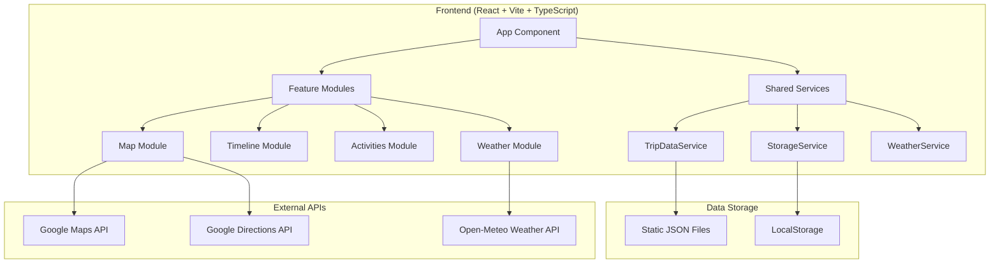

# Wanderlog Travel Journal - Design Document

## Overview

The Wanderlog Travel Journal is a React-based Single Page Application (SPA) that provides an immersive, map-centric travel planning and tracking experience. The application combines Google Maps integration with comprehensive activity management, timeline navigation, and persistent data storage to create a digital travel companion.

### Design Principles
- **Map-First Interface**: Google Maps serves as the primary background with floating UI components positioned as overlays
- **Frosted Glass Design**: Floating panels use semi-transparent backgrounds with backdrop blur effects for modern aesthetics
- **Mobile-First Responsive Design**: Optimized for mobile travelers with touch-friendly interactions
- **Expandable Interface**: Accommodation/activities panel supports collapsed and expanded states for efficient space utilization
- **Vivid Color Palette**: Modern, dynamic color scheme using Tailwind Colors v4 for enhanced visual appeal
- **Data Persistence**: Client-side storage with export capabilities for user modifications
- **Progressive Enhancement**: Graceful degradation when external services are unavailable

## Architecture

### High-Level Architecture



### Technology Stack

- **Frontend Framework**: React 18+ with TypeScript
- **Build Tool**: Vite for fast development and optimized builds
- **Map Integration**: @react-google-maps/api for Google Maps
- **Drag & Drop**: @dnd-kit/core for activity reordering (modern, accessible alternative to react-beautiful-dnd)
- **Styling**: Tailwind CSS for utility-first styling
- **State Management**: React Context API + useReducer for global state
- **Data Fetching**: Native fetch API with custom hooks
- **Date Handling**: date-fns for timezone-aware date operations
- **Deployment**: GitHub Pages with Vite base path configuration

### Project Structure

```
src/
├── components/
│   ├── Layout/                 # Layout and error handling components
│   │   ├── ErrorBoundary.tsx
│   │   ├── LoadingSpinner.tsx
│   │   ├── ErrorMessage.tsx
│   │   └── LocationWarning.tsx
│   ├── Map/                    # Map-related components
│   │   ├── MapContainer.tsx
│   │   ├── TripRoute.tsx

│   │   ├── AccommodationPin.tsx
│   │   └── ActivityPin.tsx
│   ├── Timeline/               # Timeline navigation components
│   │   ├── TimelineStrip.tsx
│   │   ├── TimelineBase.tsx
│   │   └── TimelineControls.tsx
│   ├── Cards/                  # Content card components
│   │   ├── AccommodationCard.tsx
│   │   ├── ActivityCard.tsx
│   │   ├── ScenicWaypointCard.tsx
│   │   └── WeatherCard.tsx
│   └── Activities/             # Activity management components
│       ├── ActivityList.tsx
│       ├── ActivityItem.tsx
│       └── DraggableActivity.tsx
├── hooks/                      # Custom React hooks
│   ├── useAppState.ts         # Global application state
│   ├── useTripData.ts         # Trip data loading and management
│   ├── useWeather.ts          # Weather data fetching
│   ├── useGeolocation.ts      # Device location services
│   └── useLocalStorage.ts     # LocalStorage operations
├── services/                   # Business logic and API services
│   ├── tripDataService.ts     # Static JSON data loading
│   ├── storageService.ts      # LocalStorage persistence
│   ├── weatherService.ts      # Open-Meteo API integration
│   ├── mapsService.ts         # Google Maps utilities
│   └── exportService.ts       # Data export functionality
├── types/                      # TypeScript type definitions
│   ├── trip.ts               # Trip data models
│   ├── weather.ts            # Weather data models
│   ├── map.ts                # Map-related types
│   └── storage.ts            # Storage-related types
├── utils/                      # Utility functions
│   ├── dateUtils.ts          # Date/timezone operations
│   ├── mapUtils.ts           # Map coordinate utilities
│   ├── exportUtils.ts        # Data export helpers
│   └── validationUtils.ts    # Data validation
├── contexts/                   # React Context providers
│   ├── AppStateContext.tsx   # Global application state
│   └── ThemeContext.tsx      # Theme and styling context
└── assets/                     # Static assets
    ├── images/
    ├── icons/
    └── styles/
```

## Components and Interfaces

### Core Components

#### 1. App Component
**Purpose**: Root component that initializes application state and provides global context.

```typescript
interface AppProps {}

interface AppState {
  tripData: TripData | null;
  currentBase: string | null;
  selectedActivity: string | null;
  userModifications: UserModifications;
  weatherData: WeatherCache;
  poiModal: POIModalState;
  loading: boolean;
  error: string | null;
}

interface POIModalState {
  isOpen: boolean;
  poi: POIDetails | null;
  loading: boolean;
  error: string | null;
}
```

#### 2. MapContainer Component
**Purpose**: Primary map interface with route visualization and pin management.

```typescript
interface MapContainerProps {
  tripData: TripData;
  currentBase: string;
  selectedActivity?: string;
  onActivitySelect: (activityId: string) => void;
  onBaseSelect: (baseId: string) => void;
}
```

**Key Features**:
- Google Maps integration with custom styling
- Route polylines with scenic waypoints
- Location-specific pin icons:

  - Accommodation locations: Lodge-style pins (uses accommodation location if available, otherwise falls back to base location)
  - Activity locations: Activity pins with location pin and color differentiation by visited status
  - Scenic waypoint locations: Violet-styled pins with landscape/mountain icons (violet for unvisited, green for visited)
- Pin status-based styling and interactions
- **Marker Titles**: Displays "Stop Name - Accommodation Name" when accommodation exists, or just "Stop Name" when accommodation is not provided
- Click handlers for pin selection and map interaction
- Coordinated drop pin animations for accommodation and scenic waypoints when stops are selected
- Map layer picker integration for changing map types and toggling overlay layers
- **Place click centering and zooming**: When any place pin is clicked, the map automatically pans and zooms to center on the location

**Place Selection Centering Behavior**:
- **Zoom Level**: Uses a constant `PLACE_ZOOM_LEVEL = 14` (neighborhood-level view) for all place types
- **Pan Animation**: Smooth pan transition using `map.panTo()` to center the selected location
- **Zoom Animation**: Automatic zoom using `map.setZoom()` to provide detailed view of the area
- **Supported Place Types**: Accommodations, activities, scenic waypoints, and POI search results
- **Trigger Sources**: Works for both map pin clicks AND selections from the ActivitiesPanel/Timeline
- **Implementation**: Centering is handled via useEffect hooks watching `selectedActivityId` and `currentBaseId` changes, ensuring consistent behavior regardless of selection source
- **UX Purpose**: Provides immediate visual context when selecting a place, making it easy to see surrounding POIs and navigation options

#### 2.1. MapLayerPicker Component
**Purpose**: Floating control for switching between map types and toggling overlay layers.

```typescript
type MapTypeId = 'roadmap' | 'satellite' | 'terrain' | 'hybrid';

interface OverlayLayers {
  traffic: boolean;
  transit: boolean;
  bicycling: boolean;
}

interface MapLayerPickerProps {
  map: google.maps.Map | null;
  currentMapType: MapTypeId;
  overlayLayers: OverlayLayers;
  onMapTypeChange: (mapType: MapTypeId) => void;
  onOverlayToggle: (layer: keyof OverlayLayers) => void;
}
```

**Key Features**:
- **Position**: Bottom-left corner of the map with `absolute bottom-4 left-4 z-10` positioning
- **Toggle Button**: Layers icon button (40x40px) with frosted glass styling
- **Expandable Panel**: Opens upward from the button when clicked
- **Map Types Section**: Grid of options for Default, Satellite, Terrain, and Hybrid map types
- **Overlay Layers Section**: Toggle buttons for Traffic, Transit, and Bicycling layers
- **Visual Feedback**: Selected map type highlighted with Sky-500, active overlay layers highlighted with Emerald-500
- **Dismiss Behavior**: Panel closes when clicking outside or pressing Escape key
- **Accessibility**: ARIA labels and keyboard navigation support

**Map Type Options**:
| Type | Label | Icon | Description |
|------|-------|------|-------------|
| roadmap | Default | 🗺️ | Standard road map with custom travel-journal styling |
| satellite | Satellite | 🛰️ | Satellite imagery view |
| terrain | Terrain | ⛰️ | Physical relief map showing terrain features |
| hybrid | Hybrid | 🌍 | Satellite imagery with road labels overlay |

**Overlay Layer Options**:
| Layer | Label | Icon | Description |
|-------|-------|------|-------------|
| traffic | Traffic | 🚗 | Real-time traffic conditions overlay |
| transit | Transit | 🚇 | Public transportation routes and stations |
| bicycling | Bicycling | 🚴 | Bike paths and bike-friendly routes |

**Styling Notes**:
- Panel uses frosted glass aesthetic: `bg-white/90 backdrop-blur-md rounded-xl border border-white/30 shadow-lg`
- Button transitions between normal and active states with color changes
- Hover effects with scale transitions for better interactivity
- Custom map styling is only applied to roadmap type; other types use native Google Maps appearance

#### 3. TimelineStrip Component
**Purpose**: Timeline panel with responsive positioning and expand/collapse functionality - full-width at top on mobile, floating panel at top-left on desktop.

```typescript
interface TimelineStripProps {
  stops: TripBase[];
  currentStopId: string | null;
  onStopSelect: (stopId: string) => void;
  className?: string; // For responsive positioning
}
```

**Key Features**:
- **Desktop Layout**: Floating panel at top-left with expand/collapse functionality
- **Mobile Layout**: Full-width panel at top with icon-based collapse
- **Expandable/Collapsible Interface**:
  - Expanded (default): Shows all stops with horizontal scroll, chevron up button on right
  - Collapsed: Shows only current stop button (desktop) or initials icon (mobile), chevron down button
- **State Persistence**: Expand/collapse state persists to localStorage ('wanderlog_timeline_expanded')
- **Smooth Transitions**: 300ms ease-in-out transitions between states
- **Responsive Width**: Auto-shrinks to ~150-200px when collapsed (desktop), icon size on mobile
- Frosted glass styling, i.e. `rounded-xl bg-white/30 backdrop-blur border border-white/20 shadow-md`
- Proportional base representation based on stay duration
- Auto-focus on current day using NZ timezone
- Touch/swipe gesture support for mobile (only in expanded state)
- Unique color assignment for each base using cycling color palette
- Selection state with enlargement and brighter colors
- **Mobile Behavior**: Selecting a stop triggers ActivitiesPanel slide-out animation

**Collapsed State Specifications:**
- Desktop: Single current stop button + chevron down button (~150-200px width)
- Mobile: Circular icon with stop initials (2 letters max) + chevron button (w-12 h-12)
- Chevron button: Integrated on right side with p-2 padding, h-5 w-5 icon size
- Same frosted glass styling as expanded state
- Touch/swipe navigation disabled in collapsed state

**Expanded State Specifications:**
- Shows all stop buttons with horizontal scrolling
- Chevron up button on right side
- Touch/swipe navigation remains functional
- Max width: max-w-2xl lg:max-w-6xl

**Stop Initials Logic:**
- Takes first letter of each word in stop name
- Uppercase, max 2 letters (e.g., "Lake Tekapo" → "LT")
- Displayed in circular button with stop color as background

#### 4. ActivitiesPanel Component
**Purpose**: Responsive panel for accommodation and activities display with mobile slide-out behavior, resizable height, and optimized scrolling.

```typescript
interface ActivitiesPanelProps {
  accommodation?: Accommodation; // Optional - some trip stops may not have accommodation
  activities: Activity[];
  scenicWaypoints?: ScenicWaypoint[];
  isExpanded: boolean;
  isVisible: boolean; // New prop for mobile visibility control
  onToggleExpanded: () => void;
  onToggleVisible: () => void; // Legacy prop for mobile panel visibility (deprecated)
  onActivitySelect: (activityId: string) => void;
  onToggleDone: (activityId: string) => void;
  className?: string; // For responsive positioning
}
```

**Key Features**:
- Frosted glass styling consistent with timeline panel
- Smooth slide-in/slide-out animations for mobile
- Smooth expand/collapse animations for desktop
- Dedicated collapsible Scenic Waypoints section with emoji indicators for better visual hierarchy
- Scenic waypoints section uses violet color scheme with dedicated wide toggle button
- Independent collapse/expand state for scenic waypoints separate from activities
- **Desktop Layout**: Floating panel positioned at top-right with appropriate screen edge gaps
  - Default State: Shows accommodation card (if available), scenic waypoints toggle button (if available), and activities expand control
  - Expanded State: Extends to bottom of screen with collapse control, becomes scrollable
- **Mobile Layout**: Hidden by default, slides out from bottom when stop is selected
  - Default State: Shows accommodation card (if available) and draggable resize handle (iOS-style pill)
  - Resizable State: User can drag the resize handle to freely adjust panel height between min (~40px, handle only) and max (calc(100vh - 4rem))
  - Scrolling Architecture: Single unified scrollable container containing all content (accommodation, scenic waypoints, activities, weather, export) with optimized spacing
- **Mobile UX**:
  - Reduced padding (px-2), compact spacing (space-y-2), smaller section headers, and consolidated action buttons to maximize content visibility
  - Overscroll containment, momentum scrolling, and touch-none on resize handle for smooth interaction
- **Panel Footer**: Fixed position at bottom of panel (flex-shrink-0)
  - Contains search row and download button
  - **Search Row**: Text input with placeholder "Search nearby places...", search button (magnifying glass icon), and clear button (X icon)
  - **Search Input**: Rose-focused styling with rose-400 border on focus
  - **Search Button**: Rose color scheme (border-rose-500/30 bg-rose-500/20)
  - **Clear Button**: Appears when input has text or results exist
  - **Download Button**: Emerald color scheme, labeled "💾 Download"
  - Frosted glass background (bg-white/20) with top border
- **POI Search Results**: Displayed in scrollable content area, below activities list
  - Shows result count header "🔍 Search Results (x)"
  - Renders POISearchResultCard for each result
  - Error display for search failures


#### 5. AccommodationCard Component
**Purpose**: Collapsible/expandable accommodation display within the activities panel with location validation.

```typescript
interface AccommodationCardProps {
  accommodation: Accommodation;
  stopName: string;
  showLocationWarning?: boolean;
}
```

**Key Features**:
- **Conditional Rendering**: Only rendered in ActivitiesPanel when accommodation data exists for the current stop
- Collapsible/expandable interface with state management
- Collapsed state: Shows only accommodation name and stop name
- Expanded state: Shows comprehensive accommodation information
- Toggle button using ChevronDownIcon/ChevronUpIcon from @heroicons/react
- Smooth transitions between collapsed and expanded states
- Thumbnail image display only when expanded
- **Interactive thumbnail**: Standardized h-16 w-16 size with click-to-view functionality
- **Thumbnail hover effect**: Scale animation (1.05x) to indicate clickability
- **Image viewer integration**: Opens full-screen modal when thumbnail is clicked
- Website link, "Open in Maps" (when google_place_id exists), and directions button only shown when expanded
- **Open in Maps button**: Opens Google Maps place page on desktop browsers and Google Maps app on mobile devices
- Location warning indicator when coordinates are missing or invalid
- Warning message with suggestions for address correction
- Consistent styling with other panel components

#### 6. ActivityCard Component
**Purpose**: Detailed activity display within the activities panel with location validation.

```typescript
interface ActivityCardProps {
  activity: Activity;
  accommodation?: Accommodation; // Optional - used for travel time calculation
  isSelected: boolean;
  onToggleDone: (activityId: string) => void;
  onNavigate: (coordinates: Coordinates) => void;
  showLocationWarning?: boolean;
}
```

**Key Features**:
- **Full-Width Layout**: Card expands to full container width (w-full) for optimal space utilization
- **Integrated Drag Functionality**: Optional drag-and-drop capability controlled by isDraggable prop
- **Optimized Spacing**: Uses individual margins (mb-2) instead of space-y-3 for better visual density
- **Conditional Layout**: Content padding adjusts based on drag handle presence (pl-8 when draggable)
- **Header Section**: Checkbox and title positioned at top with thumbnail image on the right
- **Content Sections**: Address, duration/travel time, remarks, and warnings with compact spacing
- **Action Buttons**: "View Details", "Open in Maps" (when google_place_id exists), and "Navigate in Google Maps" actions displayed side by side at bottom
- **Integrated Drag Handle**: When draggable, handle positioned inside card at left edge middle
- Comprehensive activity information display with travel time calculation from accommodation
- "Mark Done" functionality with visual feedback using vivid color palette
- Thumbnail image display positioned in header section
- **Interactive thumbnail**: Standardized h-16 w-16 size with click-to-view functionality
- **Thumbnail hover effect**: Scale animation (1.05x) to indicate clickability
- **Image viewer integration**: Opens full-screen modal with stopPropagation to prevent card selection
- **Open in Maps button**: Conditionally rendered when google_place_id exists, opens Google Maps place page on desktop browsers and Google Maps app on mobile devices
- Location warning indicator when coordinates are missing or invalid
- Warning message with suggestions for address correction
- **Reduced Bottom Spacing**: Eliminated excessive spacing for more compact card presentation

#### 6.1. ScenicWaypointCard Component
**Purpose**: Detailed scenic waypoint display within the activities panel with distinctive styling and location validation.

```typescript
interface ScenicWaypointCardProps {
  waypoint: ScenicWaypoint;
  accommodation?: Accommodation;
  isSelected: boolean;
  isDone: boolean;
  onToggleDone: (waypointId: string, done: boolean) => void;
  onSelect: (waypointId: string) => void;
}
```

**Key Features**:
- Similar layout to ActivityCard but with scenic waypoint-specific styling
- Violet color scheme with landscape emoji (🏞️) for visual distinction
- Gradient background from violet-50 to sky-50 with violet border
- "Mark Done" functionality with violet-colored checkbox
- "View Details", "Open in Maps" (when google_place_id exists), and "Navigate in Google Maps" actions displayed side by side in a single row with violet-colored buttons
- **Open in Maps button**: Opens Google Maps place page on desktop browsers and Google Maps app on mobile devices
- Location warning indicator using the same validation system as activities
- Non-draggable design to maintain original sequence from trip data
- Thumbnail image display when available
- **Interactive thumbnail**: Standardized h-16 w-16 size with click-to-view functionality
- **Thumbnail hover effect**: Scale animation (1.05x) to indicate clickability
- **Image viewer integration**: Opens full-screen modal with stopPropagation to prevent card selection
- Duration display (no travel time calculation as it's route-based)

#### 6.2. Scenic Waypoints Section Layout
**Purpose**: Dedicated root-level collapsible section for scenic waypoints within the ActivitiesPanel.

**Layout Structure**:
1. **Accommodation Card** (always visible at top)
2. **Scenic Waypoints Section** (root level, between accommodation and activities)
   - Wide toggle button with violet styling: "🏞️ Scenic Waypoints (x)"
   - Collapsed by default
   - When expanded, shows scenic waypoint cards in vertical list
   - Independent state from activities section
3. **Activities Section** (expandable to full panel height)

**Scenic Waypoints Toggle Button**:
- Full width button with violet color scheme (violet-500/20 background)
- Landscape emoji (🏞️) and count display
- Chevron icon indicating expand/collapse state
- Hover and active states with violet color transitions
- Touch-friendly 44px minimum height

#### 7. DraggableActivity Component
**Purpose**: Drag-and-drop wrapper for activity reordering within the expandable panel.

```typescript
interface DraggableActivityProps {
  activity: Activity;
  index: number;
  onReorder: (fromIndex: number, toIndex: number) => void;
  children: React.ReactNode;
}
```

**Key Features**:
- **Merged Component Architecture**: Drag-and-drop functionality integrated directly into ActivityCard component
- **Conditional Drag Functionality**: isDraggable prop enables/disables drag functionality as needed
- **Full-Width Layout**: Activity cards expand to full container width for better space utilization
- **Integrated Drag Handle**: Drag handle positioned inside card at left edge middle for intuitive dragging
- **Enhanced Touch Targets**: Drag handle sized for mobile accessibility (32px minimum)
- **Visual Feedback**: Hover and active states with sky-500 color scheme for drag handle
- **Proper Z-Index**: Drag handle positioned above card content with z-10 for accessibility
- **Optimized Spacing**: Conditional left padding (pl-8) on card content when draggable to accommodate drag handle

#### 8. POIModal Component
**Purpose**: Interactive modal dialog for displaying Point of Interest details and enabling activity creation.

```typescript
interface POIModalProps {
  poi: POIDetails | null;
  isOpen: boolean;
  loading: boolean;
  error: string | null;
  onClose: () => void;
  onAddToActivities: (poi: POIDetails) => void;
  onAddToScenicWaypoints: (poi: POIDetails) => void;
}

interface POIDetails {
  place_id: string;
  name: string;
  formatted_address?: string;
  location: { lat: number; lng: number };
  types?: string[];
  rating?: number;
  user_ratings_total?: number;
  price_level?: number;
  opening_hours?: {
    open_now?: boolean;
    weekday_text?: string[];
  };
  photos?: Array<{
    photo_reference: string;
    height: number;
    width: number;
  }>;
  website?: string;
  formatted_phone_number?: string;
  business_status?: string;
}
```

**Key Features**:
- **Modal Overlay**: Fixed position overlay with semi-transparent black background (bg-black bg-opacity-50)
- **Modal Content**: Centered dialog with rounded corners (rounded-xl), white background, and shadow (shadow-2xl)
- **Responsive Design**: Maximum width constraints (max-w-md) with appropriate padding and mobile-friendly sizing
- **Header Section**: Place name, close button, and loading/error states
- **Content Sections**:
  - High-quality place photo using Google Places Photo API (when available)
  - Place name with type tags (restaurant, attraction, etc.)
  - Address and location information
  - Star rating display with visual stars and review count
  - Price level indicators ($, $$, $$$, $$$$)
  - Opening hours with current open/closed status
  - Contact information (phone, website)
  - "Open in Google Maps" link with map icon
- **Footer Actions**:
  - Close button (gray styling)
  - "🏞️ Scenic Waypoint" button (violet styling for scenic waypoints)
  - "➕ Activity" button (emerald styling for activities)
  - All three buttons arranged in a single row with equal flex widths
  - Mobile-optimized with shortened labels and touch-friendly targets
- **Loading States**: Spinner animation with descriptive text
- **Error Handling**: User-friendly error messages with retry options
- **Accessibility**: Proper focus management, keyboard navigation, and ARIA labels

**Modal Behavior**:
- Opens when POI is clicked on map
- Prevents default Google Maps info window
- Closes via X button, backdrop click, or Escape key
- Fetches place details using Google Places API
- Integrates with global app state for activity creation
- Responsive design for mobile and desktop

#### 8.1. POISearchResultCard Component
**Purpose**: Detailed POI card component for displaying search results in the ActivitiesPanel with "Add to Activities" capability.

```typescript
interface POISearchResultCardProps {
  poi: POIDetails;
  onAddToActivities: (poi: POIDetails) => void;
}
```

**Key Features**:
- **Card Layout**: Rounded card with rose/orange gradient background and rose border
- **Photo Section**: Place photo displayed at top (h-32) with business status badge overlay
- **Content Section**: 
  - Name and type tags (rose color scheme)
  - Star rating with visual stars and review count
  - Price level indicators
  - Address (truncated)
  - Opening hours status (open now/closed)
  - Contact links (phone, website, Google Maps)
- **Action Button**: "Add to Activities" button (emerald styling) at bottom of card
- **Responsive Design**: Mobile-friendly with touch-optimized interactions
- **Visual Distinction**: Rose/coral color scheme to distinguish from regular activity cards

**Card Styling**:
- Background: `bg-gradient-to-br from-rose-50/80 to-orange-50/80`
- Border: `border border-rose-200/50`
- Rounded corners: `rounded-xl`
- Shadow: `shadow-sm` with hover `shadow-md`

#### 9. ImageViewerModal Component
**Purpose**: Full-screen modal for viewing enlarged thumbnail images from cards.

```typescript
interface ImageViewerModalProps {
  imageUrl: string;
  altText: string;
  isOpen: boolean;
  onClose: () => void;
}
```

**Key Features**:
- **Portal rendering**: Uses React Portal (createPortal) to render modal at document.body level, ensuring it displays over entire application
- **Full-screen overlay**: Fixed positioning with dark backdrop (bg-black bg-opacity-90)
- **Centered image display**: Maximum dimensions 90vh × 90vw with object-contain for aspect ratio preservation
- **Close button**: Top-right positioned X button with white styling on dark background
- **Dismissal methods**: Backdrop click, close button, and ESC key support
- **Loading state**: Spinner animation while image loads
- **Error handling**: Error message display for failed image loads
- **Body scroll prevention**: Prevents background scrolling while modal is open
- **Accessibility**: ARIA labels, role="dialog", focus management
- **Touch optimization**: Min 44px touch targets following mobile guidelines

**Modal Behavior**:
- Opens when thumbnail image is clicked in any card component
- Resets loading/error states when opening with new image
- Prevents body scroll while open
- Removes event listeners on unmount
- Uses local state in parent card components (not global state)
- Renders via React Portal to escape parent container hierarchy and display over entire app

#### 10. Pin Components
**Purpose**: Map marker components with enhanced visibility, glow animations, and location-specific styling using polished Material Design icons.

**Pin Icon Specifications**:
- **Size**: All pins SHALL be sized 1.5x larger than Google Maps default built-in icons for enhanced visibility (30px base, 33px hovered/selected)
- **Colors**: All pins SHALL use vibrant colors from the application's color palette for maximum visual prominence
- **Icons**: Polished Material Design filled SVG icons for modern, sleek appearance

- **Accommodation Pins**: Material Design home icon with status-based coloring using Orange-500 for active states
- **Activity Pins**: Material Design location pin icon with color differentiation by visited status:
  - All unvisited activities: Color varies by activity type (see getActivityTypeColor() in activityUtils.ts)
  - All visited activities: Emerald-500 (#10b981) green color
- **Scenic Waypoint Pins**: Material Design landscape icon with Violet-500 (#8b5cf6) for unvisited, Emerald-500 for visited

**Glow Animation Effects**:
- **Continuous Glow**: Subtle pulsing glow animation that runs continuously on all pins
  - Uses SVG feGaussianBlur filter with stdDeviation of 2
  - Glow color matches pin color with 60% opacity
  - Pulse animation cycles every 2 seconds with ease-in-out timing
- **Hover Enhanced Glow**: Brighter, more prominent glow when hovering over pins
  - Filter stdDeviation increases to 4 for wider glow radius
  - Glow opacity increases to 90% for more vibrant effect
  - Pin size increases from 30px to 33px for visual feedback

**Enhanced Visibility Features**:
- Pin shadows using SVG drop-shadow filter for better contrast against map backgrounds
- Hover state scaling (1.1x) with smooth transitions
- Selection state highlighting with enhanced glow
- Consistent stroke width and color for icon outlines
- Drop pin animation for highlighted pins when locations are selected

#### 8.1. Scenic Waypoint Pin Components
**Purpose**: Map marker components for scenic waypoints with distinctive violet styling and enhanced visibility.

**Scenic Waypoint Pin Specifications**:
- **Size**: All scenic waypoint pins SHALL be sized 1.5x larger than Google Maps default built-in icons for enhanced visibility (30px base, 33px selected)
- **Colors**: Violet-500 (#8b5cf6) for unvisited waypoints, Emerald-500 (#10b981) for visited waypoints
- **Icon**: Landscape/mountain SVG path for scenic waypoint identification
- **Visual Effects**: Same enhanced visibility features as activity pins (shadows, hover scaling, stroke outlines)

**Drop Pin Animation for Scenic Waypoints**:
- **Trigger Condition**: When a trip stop is selected from the timeline, all scenic waypoints for that stop animate simultaneously
- **Animation Timing**: Staggered animation with 100ms delay between each waypoint for visual effect
- **Animation Type**: Google Maps DROP animation (600ms duration)
- **Coordination**: Scenic waypoint animations occur simultaneously with accommodation pin animation

**Drop Pin Animation Specifications**:
- **Animation Type**: CSS-based keyframe animation that simulates a pin dropping from above
- **Duration**: 600ms total animation duration for smooth, noticeable effect
- **Easing**: Cubic-bezier easing that mimics natural drop physics (fast start, bounce at end)
- **Visual Elements**:
  - Pin scales from 0.3x to 1.2x then settles to 1x size
  - Pin translates from -20px Y-offset to final position
  - Subtle bounce effect at the end using transform scale
  - Optional shadow animation that grows as pin "lands"
- **Trigger Conditions**:
  - When a trip stop is selected (accommodation pin animation)
  - When an activity is selected (activity pin animation)
  - Animation only triggers for pins that are currently visible on the map
- **Performance Considerations**:
  - Uses CSS transforms for hardware acceleration
  - Animation is non-blocking and doesn't interfere with map interactions
  - Only one animation plays at a time to avoid visual confusion

#### 9. LocationWarning Component
**Purpose**: Warning indicator for activities and accommodations with invalid or missing location data.

```typescript
interface LocationWarningProps {
  type: 'activity' | 'accommodation';
  message?: string;
  className?: string;
}
```

**Key Features**:
- Prominent warning icon with Amber-500 color for attention
- Clear messaging about location data issues
- Suggestions for correcting address information
- Non-blocking design that doesn't prevent other functionality
- Consistent styling with travel journal aesthetic
- Responsive design for mobile and desktop

#### 11. PlaceHoverCard Component
**Purpose**: Popover card that displays place details when hovering over map pins for accommodations, activities, and scenic waypoints.

```typescript
type PlaceType = 'accommodation' | 'activity' | 'scenic_waypoint';

interface PlaceHoverCardProps {
  placeType: PlaceType;
  accommodation?: Accommodation;
  activity?: Activity;
  scenicWaypoint?: ScenicWaypoint;
  stopName?: string;
  isDone?: boolean;
  position: { x: number; y: number };
  isVisible: boolean;
}
```

**Key Features**:
- **Frosted Glass Styling**: Consistent with other UI components using semi-transparent white background and backdrop blur
- **Thumbnail Display**: Shows place thumbnail image (16x16 rem) when available from trip data
- **Place Information**:
  - Type icon and label (accommodation/activity type/scenic waypoint)
  - Place name (truncated if too long)
  - Stop name for accommodations
  - Address with location pin icon
  - Duration for activities and scenic waypoints
  - Completion status indicator (checkmark for done, outline for pending)
- **Color Coding**: Border and glow colors match pin type:
  - Accommodation: Orange-200 border with orange shadow
  - Activity: Sky-200 (unvisited) or Emerald-200 (done) border
  - Scenic Waypoint: Violet-200 (unvisited) or Emerald-200 (done) border
- **Positioning**: Fixed position near the hovered marker, offset 20px right and centered vertically
- **Animation**: Fade-in and slide-in animation for smooth appearance
- **Auto-dismiss**: Card disappears when mouse leaves the pin

**Hover Card Behavior**:
- Appears immediately on mouse enter (no delay)
- Positioned using screen coordinates converted from lat/lng
- Non-interactive (pointer-events: none) to allow clicking through to marker
- Z-index of 1000 to appear above other map elements

### Custom Hooks

#### 1. useAppState Hook
**Purpose**: Global application state management using Context API and useReducer.

```typescript
interface AppState {
  tripData: TripData | null;
  currentBase: string | null;
  selectedActivity: string | null;
  userModifications: UserModifications;
  weatherData: WeatherCache;
  loading: boolean;
  error: string | null;
}

type AppAction =
  | { type: 'SET_TRIP_DATA'; payload: TripData }
  | { type: 'SELECT_BASE'; payload: string }
  | { type: 'SELECT_ACTIVITY'; payload: string }
  | { type: 'TOGGLE_ACTIVITY_DONE'; payload: string }
  | { type: 'REORDER_ACTIVITIES'; payload: { baseId: string; fromIndex: number; toIndex: number } }
  | { type: 'SET_WEATHER_DATA'; payload: { baseId: string; weather: WeatherData } }
  | { type: 'ADD_ACTIVITY_FROM_POI'; payload: { baseId: string; activity: Activity } }
  | { type: 'ADD_SCENIC_WAYPOINT_FROM_POI'; payload: { baseId: string; waypoint: ScenicWaypoint } }
  | { type: 'SET_ERROR'; payload: string }
  | { type: 'SET_LOADING'; payload: boolean };
```

#### 2. useTripData Hook
**Purpose**: Trip data loading, validation, and management.

```typescript
interface UseTripDataReturn {
  tripData: TripData | null;
  loading: boolean;
  error: string | null;
  refetchData: () => Promise<void>;
}
```

#### 3. useWeather Hook
**Purpose**: Weather data fetching with caching and error handling.

```typescript
interface UseWeatherReturn {
  weatherData: WeatherCache;
  fetchWeather: (coordinates: Coordinates, baseId: string) => Promise<void>;
  loading: boolean;
  error: string | null;
}
```

## Data Models

### Trip Data Schema

```typescript
interface TripData {
  trip_name: string;
  timezone: string;
  stops: TripBase[];
}

interface TripBase {
  stop_id: string;
  name: string;
  date: {
    from: string; // YYYY-MM-DD
    to: string;   // YYYY-MM-DD
  };
  location: Coordinates;
  duration_days: number;
  travel_time_from_previous?: string;
  scenic_waypoints?: ScenicWaypoint[];
  accommodation?: Accommodation; // Optional - some stops may not have accommodation
  activities: Activity[];
}

interface Accommodation {
  name: string;
  address: string;
  check_in: string;    // YYYY-MM-DD HH:mm
  check_out: string;   // YYYY-MM-DD HH:mm
  confirmation?: string;
  url?: string;
  thumbnail_url?: string;
}

interface Activity {
  activity_id: string;
  activity_name: string;
  activity_type?: ActivityType;
  location?: {
    lat?: number;
    lng?: number;
    address?: string;
  };
  duration?: string;
  travel_time_from_accommodation?: string;
  url?: string;
  remarks?: string;
  thumbnail_url?: string;
  order?: number;
  status?: {
    done: boolean;
  };
}

enum ActivityType {
  RESTAURANT = 'restaurant',
  ATTRACTION = 'attraction', 
  SHOPPING = 'shopping',
  OUTDOOR = 'outdoor',
  CULTURAL = 'cultural',
  TRANSPORT = 'transport',
  OTHER = 'other'
}

interface ScenicWaypoint {
  activity_id: string;
  activity_name: string;
  location: {
    lat?: number;
    lng?: number;
    address?: string;
  };
  duration?: string;
  url?: string;
  remarks?: string;
  thumbnail_url?: string | null;
  status?: {
    done: boolean;
  };
}

interface Coordinates {
  lat: number;
  lng: number;
}
```

### User Modifications Schema

```typescript
interface UserModifications {
  activityStatus: Record<string, boolean>; // activityId -> done status
  activityOrders: Record<string, number[]>; // baseId -> ordered activity indices
  lastViewedBase?: string;
  lastViewedDate?: string;
}
```

### Map Layer Preferences Schema

```typescript
type MapTypeId = 'roadmap' | 'satellite' | 'terrain' | 'hybrid';

interface OverlayLayers {
  traffic: boolean;
  transit: boolean;
  bicycling: boolean;
}

interface MapLayerPreferences {
  mapType: MapTypeId;
  overlayLayers: OverlayLayers;
}
```

**Storage Details:**
- **Key**: `wanderlog_map_layer_preferences`
- **Default Values**: `{ mapType: 'roadmap', overlayLayers: { traffic: false, transit: false, bicycling: false } }`
- **Persistence**: Saved immediately on map type change or overlay layer toggle
- **Load Behavior**: Preferences restored from LocalStorage on application load
- **Validation**: Invalid data in storage results in default values being used

### Weather Data Schema

```typescript
interface WeatherData {
  temperature_2m_max: number;
  temperature_2m_min: number;
  precipitation_probability_max: number;
  weather_code: number;
  time: string; // ISO date string
}

interface WeatherCache {
  [baseId: string]: {
    data: WeatherData;
    lastFetched: number; // timestamp
    expires: number;     // timestamp
  };
}
```

## Services Architecture

### 1. TripDataService
**Purpose**: Static JSON data loading and validation.

```typescript
class TripDataService {
  static async loadTripData(filename: string): Promise<TripData>;
  static validateTripData(data: unknown): data is TripData;
  static calculateTravelTimes(tripData: TripData): Promise<TripData>;
}
```

### 2. StorageService
**Purpose**: LocalStorage operations with error handling.

```typescript
class StorageService {
  static getUserModifications(): UserModifications;
  static saveUserModifications(modifications: UserModifications): void;
  static getWeatherCache(): WeatherCache;
  static saveWeatherCache(cache: WeatherCache): void;
  static isAvailable(): boolean;
  
  // Map Layer Preferences
  static getMapLayerPreferences(): MapLayerPreferences;
  static saveMapLayerPreferences(preferences: MapLayerPreferences): void;
  static saveMapType(mapType: MapTypeId): void;
  static saveOverlayLayers(overlayLayers: OverlayLayers): void;
}
```

**Map Layer Storage Functions:**
- **getMapLayerPreferences()**: Returns the stored map layer preferences, or defaults if not found or invalid
- **saveMapLayerPreferences(preferences)**: Saves the complete map layer preferences object
- **saveMapType(mapType)**: Updates only the map type while preserving overlay layers
- **saveOverlayLayers(overlayLayers)**: Updates only the overlay layers while preserving map type

### 3. WeatherService
**Purpose**: Open-Meteo API integration with caching.

```typescript
class WeatherService {
  static async fetchWeatherData(coordinates: Coordinates): Promise<WeatherData>;
  static getCachedWeather(baseId: string): WeatherData | null;
  static isCacheValid(cacheEntry: { expires: number }): boolean;
}
```

### 4. ExportService
**Purpose**: Data export functionality with user modifications.

```typescript
class ExportService {
  static exportTripData(
    originalData: TripData, 
    modifications: UserModifications
  ): TripData;
  static downloadAsJSON(data: TripData, filename: string): void;
}
```

### 5. PlacesService
**Purpose**: Google Places API integration for POI discovery and details.

```typescript
class PlacesService {
  private placesService: google.maps.places.PlacesService | null;
  
  static getInstance(): PlacesService;
  initialize(map: google.maps.Map): void;
  
  async getPlaceDetails(placeId: string): Promise<POIDetails>;
  async searchNearby(
    location: google.maps.LatLng | google.maps.LatLngLiteral,
    radius?: number,
    type?: string
  ): Promise<google.maps.places.PlaceResult[]>;
  async textSearch(query: string): Promise<google.maps.places.PlaceResult[]>;
}
```

**Key Features**:
- **Singleton Pattern**: Ensures single instance across the application
- **Map Integration**: Requires Google Maps instance for Places service initialization
- **Place Details**: Fetches comprehensive place information using place_id
- **Search Functionality**: Supports nearby search and text-based search
- **Error Handling**: Proper error handling for API failures and quota limits
- **Type Safety**: Full TypeScript integration with Google Maps Places types

## Error Handling Strategy

### Error Boundaries
- **Global Error Boundary**: Catches unhandled JavaScript errors and displays fallback UI
- **Feature-Specific Boundaries**: Isolate errors within map, timeline, or activity components

### API Error Handling
1. **Google Maps API Failures**:
   - Display grid background with "Map unavailable" overlay
   - Continue functioning with static coordinates

2. **Google Directions API Failures**:
   - Fall back to straight-line polylines between bases
   - Log error and notify user of reduced functionality

3. **Weather API Failures**:
   - Display "Weather unavailable" placeholder
   - Cache previously successful requests

4. **Network Connectivity Issues**:
   - Detect offline status
   - Use cached data when available
   - Display appropriate user feedback

### Data Validation
- **JSON Schema Validation**: Validate trip data structure on load
- **Type Guards**: Runtime type checking for external data
- **Graceful Degradation**: Handle missing optional fields

## Visual Design System

### Color Palette
The application uses a vivid, modern, and dynamic color scheme based on Tailwind Colors v4, replacing the previous teal/gray theme:

**Timeline Color Palette:**
The timeline uses a cycling 12-color palette from Tailwind Colors v4 for maximum visual distinction:
- **Blue-500**: (`bg-blue-500`, `bg-blue-600` selected) - First timeline base color
- **Emerald-500**: (`bg-emerald-500`, `bg-emerald-600` selected) - Second timeline base color  
- **Violet-500**: (`bg-violet-500`, `bg-violet-600` selected) - Third timeline base color
- **Orange-500**: (`bg-orange-500`, `bg-orange-600` selected) - Fourth timeline base color
- **Rose-500**: (`bg-rose-500`, `bg-rose-600` selected) - Fifth timeline base color
- **Cyan-500**: (`bg-cyan-500`, `bg-cyan-600` selected) - Sixth timeline base color
- **Amber-500**: (`bg-amber-500`, `bg-amber-600` selected) - Seventh timeline base color
- **Pink-500**: (`bg-pink-500`, `bg-pink-600` selected) - Eighth timeline base color
- **Indigo-500**: (`bg-indigo-500`, `bg-indigo-600` selected) - Ninth timeline base color
- **Teal-500**: (`bg-teal-500`, `bg-teal-600` selected) - Tenth timeline base color
- **Lime-500**: (`bg-lime-500`, `bg-lime-600` selected) - Eleventh timeline base color
- **Fuchsia-500**: (`bg-fuchsia-500`, `bg-fuchsia-600` selected) - Twelfth timeline base color

**Additional Application Colors:**
- **Success**: Emerald-500 (`bg-emerald-500`, `text-emerald-500`) - Rich green for completed activities and positive feedback
- **Warning**: Amber-500 (`bg-amber-500`, `text-amber-500`) - Bright amber for pending or attention-required states

**Timeline Selection States:**
- **Unselected**: Base color at 500 level (e.g., `bg-blue-500`, `bg-emerald-500`)
- **Selected**: Darker shade at 600 level with ring outline and 110% scale (e.g., `bg-blue-600 ring-blue-500`, `bg-emerald-600 ring-emerald-500`)
- **Hover**: Enhanced shadow and 105% scale with transition effects

**General Interactive States:**
- **Hover**: Enhanced shadow and subtle scale effects (`hover:shadow-lg hover:scale-105`)
- **Active**: Slight scale reduction for tactile feedback (`active:scale-95`)
- **Focus**: Color-specific ring utilities matching the element's base color

**Mobile Touch States:**
- **Touch Targets**: Minimum 44px height and width for all interactive elements (`min-h-[44px] min-w-[44px]`)
- **Touch Manipulation**: Applied globally with `touch-action: manipulation` for optimal touch response
- **Active Feedback**: Enhanced active states for immediate visual feedback on touch

### Frosted Glass Styling
Consistent styling applied to all floating panels:

```css
.frosted-panel {
  @apply rounded-xl bg-white/30 backdrop-blur border border-white/20 shadow-md;
}
```

**Additional Variations:**
- **Hover State**: `bg-white/40` with `shadow-lg`
- **Active State**: `bg-white/50` with enhanced border opacity
- **Dark Mode Support**: `bg-black/20` with `border-black/30`

### Layout Specifications

**Responsive Panel Positioning:**
- **Timeline Panel**: 
  - Mobile: `absolute top-0 left-0 right-0` for full-width positioning at top edge
  - Desktop: `absolute top-2 left-2 sm:top-4 sm:left-4` with responsive adjustments
- **Activities Panel**: 
  - Mobile: `fixed bottom-0 left-0 right-0` with slide-up animation, hidden by default
  - Desktop: `absolute top-2 right-2 sm:top-4 sm:right-4` with responsive adjustments
- **Gap Specifications**: 
  - Mobile Timeline: No gaps, full-width at top edge
  - Mobile Activities: No gaps, slides from bottom edge
  - Desktop: 1rem (16px) gap from screen edges on sm+ breakpoints

**Panel Dimensions:**
- **Timeline Panel**: 
  - Mobile: `w-full` spanning entire screen width
  - Desktop: `max-w-2xl lg:max-w-4xl` based on content with horizontal scrolling
- **Activities Panel**: 
  - Mobile: `w-full` spanning entire screen width, slides up from bottom
  - Desktop: `w-96` fixed width
  - Mobile Collapsed: Hidden completely below screen
  - Mobile Expanded: `h-[calc(100vh-5rem)]` to maximize scrollable space while accounting for timeline (4rem) and collapse button header (1rem)
  - Mobile Scrollable Area: Single container with `flex-1 overflow-y-auto` containing all content with optimized spacing
  - Mobile Compact Layout: `px-2` horizontal padding, `space-y-2` vertical spacing, reduced section header sizes
  - Desktop Collapsed: Auto-height for accommodation card only
  - Desktop Expanded: `top-2 sm:top-4` to `bottom-2 sm:bottom-4` with scroll overflow

### Animation Specifications
- **Panel Expand/Collapse**: 300ms ease-in-out transition
- **Mobile Panel Slide**: 400ms ease-in-out transition for slide-up/slide-down animations
- **Mobile Panel Resize**: Real-time height adjustment during drag (no transition for responsiveness)
- **Timeline Selection**: Triggers ActivitiesPanel slide-out on mobile with 100ms delay
- **Hover Effects**: 150ms ease-out transition
- **Pin Highlighting**: 200ms ease-in-out scale and color transitions
- **Drop Pin Animation**: 600ms cubic-bezier animation with bounce effect for location highlighting
- **Activity Status Changes**: 250ms fade transition
- **Touch Feedback**: 200ms transition for active states and scale effects
- **Drag and Drop**: 200ms transform transition with scale effects during dragging
- **Resize Handle**: Immediate cursor feedback (grab/grabbing), no transition delay for responsive feel

### Mobile Layout and Panel Management Design Patterns

The mobile layout system is designed to maximize content visibility and usability on small screens through efficient panel management and space optimization.

#### Mobile Panel Management Strategy

**Panel Visibility Control:**
- **Timeline Panel**: Always visible at top, full-width positioning
- **Activities Panel**: Hidden by default, slides out from bottom when stop is selected
- **Resize Mechanism**: Draggable iOS-style resize handle to adjust panel height

**Panel State Management:**
- **Default State**: Map-only view with timeline at top
- **Active State**: Activities panel slides up with user-adjustable height (default 50% of available space)
- **Transition Animations**: Smooth slide-up/slide-down with 400ms ease-in-out timing

**Mobile Resize Handle:**
- **Appearance**: iOS-style horizontal pill (w-10 h-1.5 rounded-full bg-gray-400)
- **Position**: Fixed header outside scrollable area, always visible when panel is shown
- **Interaction**: Touch/mouse drag to resize panel height
- **Constraints**: Min height ~40px (handle only), max height calc(100vh - 4rem)
- **Visual Feedback**: cursor-grab on hover, cursor-grabbing while dragging, touch-none for smooth drag

#### Mobile Layout Optimization for Limited Screen Space

**Space Allocation Strategy:**
The mobile layout prioritizes content visibility over visual spacing through a hierarchical space allocation system:

1. **Fixed Elements (Non-scrollable)**:
   - Timeline strip: 4rem (64px) height at top
   - Resize handle: ~24px height (py-3 container with 6px pill)
   - Total reserved space: ~88px at minimum

2. **Scrollable Content Area**:
   - Available height: User-controlled via drag (default 50% of viewport minus timeline)
   - Single unified container prevents scroll conflicts
   - Optimized for maximum content density

**Compact Layout Implementation:**
```css
/* Mobile-specific spacing overrides */
.mobile-activities-panel {
  /* Reduced horizontal padding */
  @apply px-2; /* Instead of px-3 */
  
  /* Compact vertical spacing */
  .content-sections {
    @apply space-y-2; /* Instead of space-y-3 */
  }
  
  /* Compact card spacing */
  .activity-cards {
    @apply space-y-2; /* 8px instead of 12px */
  }
  
  /* Reduced section headers */
  .section-header {
    @apply text-base py-2; /* Instead of text-lg py-3 */
  }
}
```

**Content Prioritization:**
- **Primary Content**: Activity and waypoint cards get maximum space allocation
- **Secondary Content**: Section headers use minimal vertical space
- **Tertiary Content**: Action buttons are consolidated and compact
- **Hidden Content**: Non-essential decorative elements are hidden on mobile

#### Touch Interaction Guidelines
- **Minimum Touch Targets**: All interactive elements implement 44px minimum height/width following iOS and Android guidelines
- **Touch Feedback**: Immediate visual feedback through active states and subtle scale effects
- **Gesture Support**: 
  - Timeline swipe navigation with proper distance thresholds (50px minimum)
  - Drag and drop with enhanced activation constraints (10px distance, 100ms delay)
  - Overscroll containment to prevent unwanted page bouncing

#### Responsive Layout Strategy
- **Mobile-First Approach**: Base styles optimized for mobile, enhanced for larger screens
- **Breakpoint Strategy**: Single `sm:` breakpoint at 640px for tablet/desktop enhancements
- **Content Prioritization**: 
  - Accommodation card always visible in collapsed state
  - Activities accessible through expandable interface
  - Essential actions (navigate, mark done) prominently displayed

#### Mobile Performance Optimizations
- **Touch Action Optimization**: `touch-action: manipulation` prevents double-tap zoom delays
- **Smooth Scrolling**: `-webkit-overflow-scrolling: touch` for native momentum scrolling
- **Tap Highlight Removal**: `-webkit-tap-highlight-color: transparent` for custom feedback
- **Overscroll Behavior**: `overscroll-behavior: contain` prevents parent container scrolling
- **Unified Scroll Container**: Single scrollable area containing all content to prevent scroll conflicts and maximize usable space
- **Optimized Height Calculation**: Uses `calc(100vh - 5rem)` to account for timeline height (4rem) and collapse button header (1rem) to maximize scrollable content area
- **Flex Layout Optimization**: Uses `flex-shrink-0` for fixed elements (collapse button header) and `flex-1` for scrollable content to ensure proper space distribution
- **Compact Layout System**: Implements `px-2` horizontal padding, `space-y-2` vertical spacing, and reduced section header sizes to maximize content visibility
- **Optimized Card Spacing**: Uses 8px spacing between cards and sections instead of default 12px to fit more content in limited mobile viewport
- **Consolidated Action Buttons**: Groups related actions and uses compact button styling to reduce vertical space consumption

#### Mobile Scrolling Optimization Strategy

**Space Allocation Hierarchy:**
1. **Fixed Header**: Collapse button (1rem height) positioned outside scrollable area
2. **Scrollable Content**: Remaining space using `calc(100vh - 5rem)` for maximum content area
3. **Compact Spacing**: Reduced padding and margins throughout to maximize content density

**Content Layout Optimization:**
- **Accommodation Card**: Compact presentation with essential information only
- **Scenic Waypoints**: Collapsible section with 8px card spacing when expanded
- **Activities List**: Compact card layout with reduced vertical spacing
- **Section Headers**: Smaller font sizes and minimal padding to preserve content space
- **Action Buttons**: Consolidated and compact styling to reduce vertical footprint

**Scrolling Performance:**
- **Single Container**: All content in unified scrollable area to prevent nested scroll conflicts
- **Momentum Scrolling**: Native iOS/Android momentum with proper overscroll containment
- **Touch Optimization**: Optimized touch targets while maintaining compact layout
- **Memory Efficiency**: Virtualized scrolling for large activity lists (future enhancement)

#### Accessibility Considerations
- **Focus Management**: Visible focus indicators for keyboard navigation
- **Screen Reader Support**: Proper ARIA labels and semantic HTML structure
- **Color Contrast**: All color combinations maintain WCAG AA compliance
- **Touch Target Spacing**: Adequate spacing between interactive elements to prevent accidental taps while maintaining compact mobile layout

## Testing Strategy

### Unit Testing
- **Component Tests**: Test individual components with React Testing Library
- **Hook Tests**: Test custom hooks with @testing-library/react-hooks
- **Service Tests**: Test business logic and API integration
- **Utility Tests**: Test helper functions and data transformations

### Integration Testing
- **User Flow Tests**: Test complete user interactions (base selection, activity reordering)
- **API Integration Tests**: Test external service integration with mock responses
- **State Management Tests**: Test global state updates and persistence

### End-to-End Testing
- **Critical Path Testing**: Test core user journeys
- **Mobile Responsiveness**: Test touch interactions and responsive design
- **Offline Functionality**: Test application behavior without network connectivity

### Performance Testing
- **Bundle Size Analysis**: Monitor and optimize bundle size
- **Runtime Performance**: Profile component render performance
- **Network Usage**: Optimize API calls and caching strategies

## Deployment Configuration

### Vite Configuration
```typescript
// vite.config.ts
export default defineConfig({
  base: '/wanderlog/',
  plugins: [react()],
  define: {
    'import.meta.env.VITE_GOOGLE_MAPS_API_KEY': JSON.stringify(process.env.VITE_GOOGLE_MAPS_API_KEY)
  },
  build: {
    outDir: 'dist',
    sourcemap: false,
    rollupOptions: {
      output: {
        manualChunks: {
          vendor: ['react', 'react-dom'],
          maps: ['@react-google-maps/api'],
          dnd: ['@dnd-kit/core', '@dnd-kit/sortable']
        }
      }
    }
  }
});
```

### Environment Variables
- **VITE_GOOGLE_MAPS_API_KEY**: Google Maps API key injected at build time
- **NODE_ENV**: Environment setting for development/production builds

## Security Considerations

### API Key Management
- Google Maps API key stored as GitHub Secret
- Referrer restrictions configured in Google Cloud Console
- Key scope limited to required APIs only

### Data Privacy
- All user data stored locally in browser
- No server-side data collection or tracking
- Export functionality provides user data portability

### Content Security Policy
- Implement CSP headers for XSS protection
- Allow-list required external domains (Google APIs, Open-Meteo)

## Performance Optimization

### Code Splitting
- Route-based code splitting for different views
- Component-level lazy loading for large features
- Vendor chunk separation for better caching

### Asset Optimization
- Image compression and lazy loading
- SVG icon optimization
- CSS purging with Tailwind CSS

### Runtime Performance
- React.memo for expensive components
- useCallback/useMemo for expensive calculations
- Virtual scrolling for large activity lists

### Caching Strategy
- Service Worker for offline functionality
- LocalStorage for user modifications and weather data
- Browser caching for static assets
