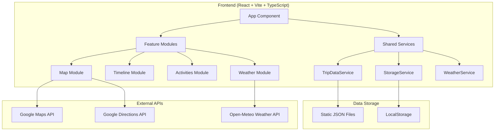

# Wanderlog Travel Journal - Design Document

## Overview

The Wanderlog Travel Journal is a React-based Single Page Application (SPA) that provides an immersive, map-centric travel planning and tracking experience. The application combines Google Maps integration with comprehensive activity management, timeline navigation, and persistent data storage to create a digital travel companion.

### Design Principles
- **Map-First Interface**: Google Maps serves as the primary background with floating UI components positioned as overlays
- **Frosted Glass Design**: Floating panels use semi-transparent backgrounds with backdrop blur effects for modern aesthetics
- **Mobile-First Responsive Design**: Optimized for mobile travelers with touch-friendly interactions
- **Expandable Interface**: Accommodation/activities panel supports collapsed and expanded states for efficient space utilization
- **Vivid Color Palette**: Modern, dynamic color scheme using Tailwind Colors v4 for enhanced visual appeal
- **Data Persistence**: Client-side storage with export capabilities for user modifications
- **Progressive Enhancement**: Graceful degradation when external services are unavailable

## Architecture

### High-Level Architecture



### Technology Stack

- **Frontend Framework**: React 18+ with TypeScript
- **Build Tool**: Vite for fast development and optimized builds
- **Map Integration**: @react-google-maps/api for Google Maps
- **Drag & Drop**: @dnd-kit/core for activity reordering (modern, accessible alternative to react-beautiful-dnd)
- **Styling**: Tailwind CSS for utility-first styling
- **State Management**: React Context API + useReducer for global state
- **Data Fetching**: Native fetch API with custom hooks
- **Date Handling**: date-fns for timezone-aware date operations
- **Deployment**: GitHub Pages with Vite base path configuration

### Project Structure

```
src/
├── components/
│   ├── Layout/                 # Layout and error handling components
│   │   ├── ErrorBoundary.tsx
│   │   ├── LoadingSpinner.tsx
│   │   ├── ErrorMessage.tsx
│   │   └── LocationWarning.tsx
│   ├── Map/                    # Map-related components
│   │   ├── MapContainer.tsx
│   │   ├── TripRoute.tsx

│   │   ├── AccommodationPin.tsx
│   │   └── ActivityPin.tsx
│   ├── Timeline/               # Timeline navigation components
│   │   ├── TimelineStrip.tsx
│   │   ├── TimelineBase.tsx
│   │   └── TimelineControls.tsx
│   ├── Cards/                  # Content card components
│   │   ├── AccommodationCard.tsx
│   │   ├── ActivityCard.tsx
│   │   ├── ScenicWaypointCard.tsx
│   │   └── WeatherCard.tsx
│   └── Activities/             # Activity management components
│       ├── ActivityList.tsx
│       ├── ActivityItem.tsx
│       └── DraggableActivity.tsx
├── hooks/                      # Custom React hooks
│   ├── useAppState.ts         # Global application state
│   ├── useTripData.ts         # Trip data loading and management
│   ├── useWeather.ts          # Weather data fetching
│   ├── useGeolocation.ts      # Device location services
│   └── useLocalStorage.ts     # LocalStorage operations
├── services/                   # Business logic and API services
│   ├── tripDataService.ts     # Static JSON data loading
│   ├── storageService.ts      # LocalStorage persistence
│   ├── weatherService.ts      # Open-Meteo API integration
│   ├── mapsService.ts         # Google Maps utilities
│   └── exportService.ts       # Data export functionality
├── types/                      # TypeScript type definitions
│   ├── trip.ts               # Trip data models
│   ├── weather.ts            # Weather data models
│   ├── map.ts                # Map-related types
│   └── storage.ts            # Storage-related types
├── utils/                      # Utility functions
│   ├── dateUtils.ts          # Date/timezone operations
│   ├── mapUtils.ts           # Map coordinate utilities
│   ├── exportUtils.ts        # Data export helpers
│   └── validationUtils.ts    # Data validation
├── contexts/                   # React Context providers
│   ├── AppStateContext.tsx   # Global application state
│   └── ThemeContext.tsx      # Theme and styling context
└── assets/                     # Static assets
    ├── images/
    ├── icons/
    └── styles/
```

## Components and Interfaces

### Core Components

#### 1. App Component
**Purpose**: Root component that initializes application state and provides global context.

```typescript
interface AppProps {}

interface AppState {
  tripData: TripData | null;
  currentBase: string | null;
  loading: boolean;
  error: string | null;
}
```

#### 2. MapContainer Component
**Purpose**: Primary map interface with route visualization and pin management.

```typescript
interface MapContainerProps {
  tripData: TripData;
  currentBase: string;
  selectedActivity?: string;
  onActivitySelect: (activityId: string) => void;
  onBaseSelect: (baseId: string) => void;
}
```

**Key Features**:
- Google Maps integration with custom styling
- Route polylines with scenic waypoints
- Location-specific pin icons:

  - Accommodation locations: Lodge-style pins
  - Activity locations: Activity pins with standardized visited status colors (blue for unvisited, green for visited)
- Pin status-based styling and interactions
- Click handlers for pin selection and map interaction

#### 3. TimelineStrip Component
**Purpose**: Floating timeline panel positioned at top-left corner with frosted glass styling.

```typescript
interface TimelineStripProps {
  bases: TripBase[];
  currentBase: string;
  onBaseSelect: (baseId: string) => void;
  timezone: string;
  className?: string; // For floating panel positioning
}
```

**Key Features**:
- Floating panel positioned at top-left with appropriate screen edge gaps
- Frosted glass styling, i.e. `rounded-xl bg-white/30 backdrop-blur border border-white/20 shadow-md`
- Proportional base representation based on stay duration
- Auto-focus on current day using NZ timezone
- Touch/swipe gesture support for mobile
- Status-based visual indicators using vivid color palette

#### 4. ActivitiesPanel Component
**Purpose**: Expandable/collapsible floating panel for accommodation and activities display.

```typescript
interface ActivitiesPanelProps {
  accommodation: Accommodation;
  activities: Activity[];
  scenicWaypoints?: ScenicWaypoint[];
  isExpanded: boolean;
  onToggleExpanded: () => void;
  onActivitySelect: (activityId: string) => void;
  onToggleDone: (activityId: string) => void;
  className?: string; // For floating panel positioning
}
```

**Key Features**:
- Floating panel positioned at top-right with appropriate screen edge gaps
- Frosted glass styling consistent with timeline panel
- Default state: Shows only accommodation card with expand control
- Expanded state: Extends to bottom of screen with collapse control, becomes scrollable
- Smooth expand/collapse animations
- Collapsible Scenic Waypoints section between accommodation and activities when available
- Scenic waypoints section uses violet color scheme for visual distinction

#### 5. AccommodationCard Component
**Purpose**: Collapsible/expandable accommodation display within the activities panel with location validation.

```typescript
interface AccommodationCardProps {
  accommodation: Accommodation;
  stopName: string;
  showLocationWarning?: boolean;
}
```

**Key Features**:
- Collapsible/expandable interface with state management
- Collapsed state: Shows only accommodation name and stop name
- Expanded state: Shows comprehensive accommodation information
- Toggle button using ChevronDownIcon/ChevronUpIcon from @heroicons/react
- Smooth transitions between collapsed and expanded states
- Thumbnail image display only when expanded
- Website link and directions button only shown when expanded
- Location warning indicator when coordinates are missing or invalid
- Warning message with suggestions for address correction
- Consistent styling with other panel components

#### 6. ActivityCard Component
**Purpose**: Detailed activity display within the activities panel with location validation.

```typescript
interface ActivityCardProps {
  activity: Activity;
  accommodation: Accommodation;
  isSelected: boolean;
  onToggleDone: (activityId: string) => void;
  onNavigate: (coordinates: Coordinates) => void;
  showLocationWarning?: boolean;
}
```

**Key Features**:
- Comprehensive activity information display
- Travel time calculation from accommodation
- "Mark Done" functionality with visual feedback using vivid color palette
- "Navigate in Google Maps" action
- Thumbnail image display
- Location warning indicator when coordinates are missing or invalid
- Warning message with suggestions for address correction

#### 6.1. ScenicWaypointCard Component
**Purpose**: Detailed scenic waypoint display within the activities panel with distinctive styling and location validation.

```typescript
interface ScenicWaypointCardProps {
  waypoint: ScenicWaypoint;
  accommodation?: Accommodation;
  isSelected: boolean;
  isDone: boolean;
  onToggleDone: (waypointId: string, done: boolean) => void;
  onSelect: (waypointId: string) => void;
}
```

**Key Features**:
- Similar layout to ActivityCard but with scenic waypoint-specific styling
- Violet color scheme with landscape emoji (🏞️) for visual distinction
- Gradient background from violet-50 to sky-50 with violet border
- "Mark Done" functionality with violet-colored checkbox
- "Navigate in Google Maps" action with violet-colored button
- Location warning indicator using the same validation system as activities
- Non-draggable design to maintain original sequence from trip data
- Thumbnail image display when available
- Duration display (no travel time calculation as it's route-based)

#### 7. DraggableActivity Component
**Purpose**: Drag-and-drop wrapper for activity reordering within the expandable panel.

```typescript
interface DraggableActivityProps {
  activity: Activity;
  index: number;
  onReorder: (fromIndex: number, toIndex: number) => void;
  children: React.ReactNode;
}
```

#### 8. Pin Components
**Purpose**: Map marker components with enhanced visibility and location-specific styling using vivid color palette.

**Pin Icon Specifications**:
- **Size**: All pins SHALL be sized 1.5x larger than Google Maps default built-in icons for enhanced visibility
- **Colors**: All pins SHALL use vibrant colors from the application's color palette for maximum visual prominence

- **Accommodation Pins**: Lodge/hotel icon with status-based coloring using Orange-500 for active states
- **Activity Pins**: Type-specific icons with standardized visited status colors:
  - All unvisited activities: Sky-500 (#0ea5e9) blue color regardless of activity type
  - All visited activities: Emerald-500 (#10b981) green color regardless of activity type
  - Icon shapes remain type-specific (restaurant: fork/knife, attraction: camera, etc.)
  - Fallback icon: Flag icon for activities without specific type classification

**Enhanced Visibility Features**:
- Pin shadows for better contrast against map backgrounds
- Hover state scaling (1.1x) with smooth transitions
- Selection state highlighting with ring effects
- Consistent stroke width and color for icon outlines
- Drop pin animation for highlighted pins when locations are selected

**Drop Pin Animation Specifications**:
- **Animation Type**: CSS-based keyframe animation that simulates a pin dropping from above
- **Duration**: 600ms total animation duration for smooth, noticeable effect
- **Easing**: Cubic-bezier easing that mimics natural drop physics (fast start, bounce at end)
- **Visual Elements**:
  - Pin scales from 0.3x to 1.2x then settles to 1x size
  - Pin translates from -20px Y-offset to final position
  - Subtle bounce effect at the end using transform scale
  - Optional shadow animation that grows as pin "lands"
- **Trigger Conditions**:
  - When a trip stop is selected (accommodation pin animation)
  - When an activity is selected (activity pin animation)
  - Animation only triggers for pins that are currently visible on the map
- **Performance Considerations**:
  - Uses CSS transforms for hardware acceleration
  - Animation is non-blocking and doesn't interfere with map interactions
  - Only one animation plays at a time to avoid visual confusion

#### 9. LocationWarning Component
**Purpose**: Warning indicator for activities and accommodations with invalid or missing location data.

```typescript
interface LocationWarningProps {
  type: 'activity' | 'accommodation';
  message?: string;
  className?: string;
}
```

**Key Features**:
- Prominent warning icon with Amber-500 color for attention
- Clear messaging about location data issues
- Suggestions for correcting address information
- Non-blocking design that doesn't prevent other functionality
- Consistent styling with travel journal aesthetic
- Responsive design for mobile and desktop

### Custom Hooks

#### 1. useAppState Hook
**Purpose**: Global application state management using Context API and useReducer.

```typescript
interface AppState {
  tripData: TripData | null;
  currentBase: string | null;
  selectedActivity: string | null;
  userModifications: UserModifications;
  weatherData: WeatherCache;
  loading: boolean;
  error: string | null;
}

type AppAction = 
  | { type: 'SET_TRIP_DATA'; payload: TripData }
  | { type: 'SELECT_BASE'; payload: string }
  | { type: 'SELECT_ACTIVITY'; payload: string }
  | { type: 'TOGGLE_ACTIVITY_DONE'; payload: string }
  | { type: 'REORDER_ACTIVITIES'; payload: { baseId: string; fromIndex: number; toIndex: number } }
  | { type: 'SET_WEATHER_DATA'; payload: { baseId: string; weather: WeatherData } }
  | { type: 'SET_ERROR'; payload: string }
  | { type: 'SET_LOADING'; payload: boolean };
```

#### 2. useTripData Hook
**Purpose**: Trip data loading, validation, and management.

```typescript
interface UseTripDataReturn {
  tripData: TripData | null;
  loading: boolean;
  error: string | null;
  refetchData: () => Promise<void>;
}
```

#### 3. useWeather Hook
**Purpose**: Weather data fetching with caching and error handling.

```typescript
interface UseWeatherReturn {
  weatherData: WeatherCache;
  fetchWeather: (coordinates: Coordinates, baseId: string) => Promise<void>;
  loading: boolean;
  error: string | null;
}
```

## Data Models

### Trip Data Schema

```typescript
interface TripData {
  trip_name: string;
  timezone: string;
  stops: TripBase[];
}

interface TripBase {
  stop_id: string;
  name: string;
  date: {
    from: string; // YYYY-MM-DD
    to: string;   // YYYY-MM-DD
  };
  location: Coordinates;
  duration_days: number;
  travel_time_from_previous?: string;
  scenic_waypoints?: ScenicWaypoint[];
  accommodation: Accommodation;
  activities: Activity[];
}

interface Accommodation {
  name: string;
  address: string;
  check_in: string;    // YYYY-MM-DD HH:mm
  check_out: string;   // YYYY-MM-DD HH:mm
  confirmation?: string;
  url?: string;
  thumbnail_url?: string;
}

interface Activity {
  activity_id: string;
  activity_name: string;
  activity_type?: ActivityType;
  location?: {
    lat?: number;
    lng?: number;
    address?: string;
  };
  duration?: string;
  travel_time_from_accommodation?: string;
  url?: string;
  remarks?: string;
  thumbnail_url?: string;
  order?: number;
  status?: {
    done: boolean;
  };
}

enum ActivityType {
  RESTAURANT = 'restaurant',
  ATTRACTION = 'attraction', 
  SHOPPING = 'shopping',
  OUTDOOR = 'outdoor',
  CULTURAL = 'cultural',
  TRANSPORT = 'transport',
  OTHER = 'other'
}

interface ScenicWaypoint {
  activity_id: string;
  activity_name: string;
  location: {
    lat?: number;
    lng?: number;
    address?: string;
  };
  duration?: string;
  url?: string;
  remarks?: string;
  thumbnail_url?: string | null;
  status?: {
    done: boolean;
  };
}

interface Coordinates {
  lat: number;
  lng: number;
}
```

### User Modifications Schema

```typescript
interface UserModifications {
  activityStatus: Record<string, boolean>; // activityId -> done status
  activityOrders: Record<string, number[]>; // baseId -> ordered activity indices
  lastViewedBase?: string;
  lastViewedDate?: string;
}
```

### Weather Data Schema

```typescript
interface WeatherData {
  temperature_2m_max: number;
  temperature_2m_min: number;
  precipitation_probability_max: number;
  weather_code: number;
  time: string; // ISO date string
}

interface WeatherCache {
  [baseId: string]: {
    data: WeatherData;
    lastFetched: number; // timestamp
    expires: number;     // timestamp
  };
}
```

## Services Architecture

### 1. TripDataService
**Purpose**: Static JSON data loading and validation.

```typescript
class TripDataService {
  static async loadTripData(filename: string): Promise<TripData>;
  static validateTripData(data: unknown): data is TripData;
  static calculateTravelTimes(tripData: TripData): Promise<TripData>;
}
```

### 2. StorageService
**Purpose**: LocalStorage operations with error handling.

```typescript
class StorageService {
  static getUserModifications(): UserModifications;
  static saveUserModifications(modifications: UserModifications): void;
  static getWeatherCache(): WeatherCache;
  static saveWeatherCache(cache: WeatherCache): void;
  static isAvailable(): boolean;
}
```

### 3. WeatherService
**Purpose**: Open-Meteo API integration with caching.

```typescript
class WeatherService {
  static async fetchWeatherData(coordinates: Coordinates): Promise<WeatherData>;
  static getCachedWeather(baseId: string): WeatherData | null;
  static isCacheValid(cacheEntry: { expires: number }): boolean;
}
```

### 4. ExportService
**Purpose**: Data export functionality with user modifications.

```typescript
class ExportService {
  static exportTripData(
    originalData: TripData, 
    modifications: UserModifications
  ): TripData;
  static downloadAsJSON(data: TripData, filename: string): void;
}
```

## Error Handling Strategy

### Error Boundaries
- **Global Error Boundary**: Catches unhandled JavaScript errors and displays fallback UI
- **Feature-Specific Boundaries**: Isolate errors within map, timeline, or activity components

### API Error Handling
1. **Google Maps API Failures**:
   - Display grid background with "Map unavailable" overlay
   - Continue functioning with static coordinates

2. **Google Directions API Failures**:
   - Fall back to straight-line polylines between bases
   - Log error and notify user of reduced functionality

3. **Weather API Failures**:
   - Display "Weather unavailable" placeholder
   - Cache previously successful requests

4. **Network Connectivity Issues**:
   - Detect offline status
   - Use cached data when available
   - Display appropriate user feedback

### Data Validation
- **JSON Schema Validation**: Validate trip data structure on load
- **Type Guards**: Runtime type checking for external data
- **Graceful Degradation**: Handle missing optional fields

## Visual Design System

### Color Palette
The application uses a vivid, modern, and dynamic color scheme based on Tailwind Colors v4, replacing the previous teal/gray theme:

**Primary Colors:**
- **Primary Accent**: Sky-500 (`bg-sky-500`, `text-sky-500`) - Vibrant blue for current timeline base, active states, and primary actions
- **Secondary Accent**: Orange-500 (`bg-orange-500`, `text-orange-500`) - Energetic orange for secondary actions, hover states, and interactive elements
- **Success**: Emerald-500 (`bg-emerald-500`, `text-emerald-500`) - Rich green for completed activities and positive feedback
- **Warning**: Amber-500 (`bg-amber-500`, `text-amber-500`) - Bright amber for pending or attention-required states
- **Info**: Violet-500 (`bg-violet-500`, `text-violet-500`) - Modern violet for informational elements and neutral actions

**Status Colors:**
- **Past/Completed**: 
  - Timeline bases: Sky-500 with 30% opacity (`bg-sky-500/30`)
  - Completed activities: Emerald-500 with 40% opacity (`bg-emerald-500/40`)
- **Current/Active**: Full intensity Sky-500 (`bg-sky-500`)
- **Upcoming/Pending**: Sky-500 with 70% opacity (`bg-sky-500/70`)

**Interactive States:**
- **Hover**: Orange-500 with 90% opacity (`hover:bg-orange-500/90`)
- **Active**: Enhanced saturation and shadow effects (`active:bg-orange-500/40`)
- **Focus**: Sky-500 with ring utilities (`focus:ring-sky-500`)

**Mobile Touch States:**
- **Touch Targets**: Minimum 44px height and width for all interactive elements (`min-h-[44px] min-w-[44px]`)
- **Touch Manipulation**: Applied globally with `touch-action: manipulation` for optimal touch response
- **Active Feedback**: Enhanced active states for immediate visual feedback on touch

### Frosted Glass Styling
Consistent styling applied to all floating panels:

```css
.frosted-panel {
  @apply rounded-xl bg-white/30 backdrop-blur border border-white/20 shadow-md;
}
```

**Additional Variations:**
- **Hover State**: `bg-white/40` with `shadow-lg`
- **Active State**: `bg-white/50` with enhanced border opacity
- **Dark Mode Support**: `bg-black/20` with `border-black/30`

### Layout Specifications

**Floating Panel Positioning:**
- **Timeline Panel**: `absolute top-2 left-2 sm:top-4 sm:left-4` with responsive adjustments
- **Activities Panel**: `absolute top-2 right-2 sm:top-4 sm:right-4` with responsive adjustments
- **Gap Specifications**: 
  - Mobile: 0.5rem (8px) gap from screen edges
  - Desktop: 1rem (16px) gap from screen edges on sm+ breakpoints

**Panel Dimensions:**
- **Timeline Panel**: 
  - Mobile: `max-w-[calc(100vw-1rem)]` with horizontal scrolling
  - Desktop: `max-w-2xl lg:max-w-4xl` based on content
- **Activities Panel**: 
  - Mobile: `w-full max-w-[calc(100vw-1rem)]` for full-width experience
  - Desktop: `w-96` fixed width
  - Collapsed: Auto-height for accommodation card only
  - Expanded: `top-2 sm:top-4` to `bottom-2 sm:bottom-4` with scroll overflow

### Animation Specifications
- **Panel Expand/Collapse**: 300ms ease-in-out transition
- **Hover Effects**: 150ms ease-out transition
- **Pin Highlighting**: 200ms ease-in-out scale and color transitions
- **Drop Pin Animation**: 600ms cubic-bezier animation with bounce effect for location highlighting
- **Activity Status Changes**: 250ms fade transition
- **Touch Feedback**: 200ms transition for active states and scale effects
- **Drag and Drop**: 200ms transform transition with scale effects during dragging

### Mobile-Specific Design Patterns

#### Touch Interaction Guidelines
- **Minimum Touch Targets**: All interactive elements implement 44px minimum height/width following iOS and Android guidelines
- **Touch Feedback**: Immediate visual feedback through active states and subtle scale effects
- **Gesture Support**: 
  - Timeline swipe navigation with proper distance thresholds (50px minimum)
  - Drag and drop with enhanced activation constraints (10px distance, 100ms delay)
  - Overscroll containment to prevent unwanted page bouncing

#### Responsive Layout Strategy
- **Mobile-First Approach**: Base styles optimized for mobile, enhanced for larger screens
- **Breakpoint Strategy**: Single `sm:` breakpoint at 640px for tablet/desktop enhancements
- **Content Prioritization**: 
  - Accommodation card always visible in collapsed state
  - Activities accessible through expandable interface
  - Essential actions (navigate, mark done) prominently displayed

#### Mobile Performance Optimizations
- **Touch Action Optimization**: `touch-action: manipulation` prevents double-tap zoom delays
- **Smooth Scrolling**: `-webkit-overflow-scrolling: touch` for native momentum scrolling
- **Tap Highlight Removal**: `-webkit-tap-highlight-color: transparent` for custom feedback
- **Overscroll Behavior**: `overscroll-behavior: contain` prevents parent container scrolling

#### Accessibility Considerations
- **Focus Management**: Visible focus indicators for keyboard navigation
- **Screen Reader Support**: Proper ARIA labels and semantic HTML structure
- **Color Contrast**: All color combinations maintain WCAG AA compliance
- **Touch Target Spacing**: Adequate spacing between interactive elements to prevent accidental taps

## Testing Strategy

### Unit Testing
- **Component Tests**: Test individual components with React Testing Library
- **Hook Tests**: Test custom hooks with @testing-library/react-hooks
- **Service Tests**: Test business logic and API integration
- **Utility Tests**: Test helper functions and data transformations

### Integration Testing
- **User Flow Tests**: Test complete user interactions (base selection, activity reordering)
- **API Integration Tests**: Test external service integration with mock responses
- **State Management Tests**: Test global state updates and persistence

### End-to-End Testing
- **Critical Path Testing**: Test core user journeys
- **Mobile Responsiveness**: Test touch interactions and responsive design
- **Offline Functionality**: Test application behavior without network connectivity

### Performance Testing
- **Bundle Size Analysis**: Monitor and optimize bundle size
- **Runtime Performance**: Profile component render performance
- **Network Usage**: Optimize API calls and caching strategies

## Deployment Configuration

### Vite Configuration
```typescript
// vite.config.ts
export default defineConfig({
  base: '/wanderlog/',
  plugins: [react()],
  define: {
    'import.meta.env.VITE_GOOGLE_MAPS_API_KEY': JSON.stringify(process.env.VITE_GOOGLE_MAPS_API_KEY)
  },
  build: {
    outDir: 'dist',
    sourcemap: false,
    rollupOptions: {
      output: {
        manualChunks: {
          vendor: ['react', 'react-dom'],
          maps: ['@react-google-maps/api'],
          dnd: ['@dnd-kit/core', '@dnd-kit/sortable']
        }
      }
    }
  }
});
```

### Environment Variables
- **VITE_GOOGLE_MAPS_API_KEY**: Google Maps API key injected at build time
- **NODE_ENV**: Environment setting for development/production builds

## Security Considerations

### API Key Management
- Google Maps API key stored as GitHub Secret
- Referrer restrictions configured in Google Cloud Console
- Key scope limited to required APIs only

### Data Privacy
- All user data stored locally in browser
- No server-side data collection or tracking
- Export functionality provides user data portability

### Content Security Policy
- Implement CSP headers for XSS protection
- Allow-list required external domains (Google APIs, Open-Meteo)

## Performance Optimization

### Code Splitting
- Route-based code splitting for different views
- Component-level lazy loading for large features
- Vendor chunk separation for better caching

### Asset Optimization
- Image compression and lazy loading
- SVG icon optimization
- CSS purging with Tailwind CSS

### Runtime Performance
- React.memo for expensive components
- useCallback/useMemo for expensive calculations
- Virtual scrolling for large activity lists

### Caching Strategy
- Service Worker for offline functionality
- LocalStorage for user modifications and weather data
- Browser caching for static assets
