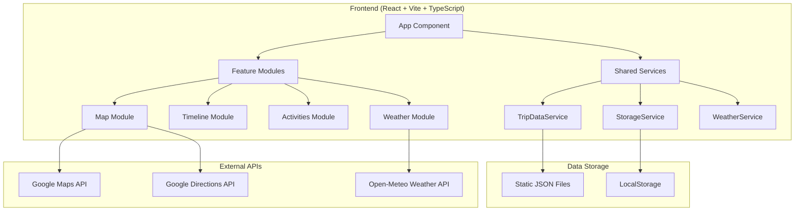

# Wanderlog Travel Journal - Design Document

## Overview

The Wanderlog Travel Journal is a React-based Single Page Application (SPA) that provides an immersive, map-centric travel planning and tracking experience. The application combines Google Maps integration with comprehensive activity management, timeline navigation, and persistent data storage to create a digital travel companion.

### Design Principles
- **Map-First Interface**: Google Maps serves as the primary background with floating UI elements
- **Mobile-First Responsive Design**: Optimized for mobile travelers with touch-friendly interactions
- **Data Persistence**: Client-side storage with export capabilities for user modifications
- **Progressive Enhancement**: Graceful degradation when external services are unavailable
- **Travel Journal Aesthetic**: Warm, inviting color palette with journal-style UI elements

## Architecture

### High-Level Architecture



### Technology Stack

- **Frontend Framework**: React 18+ with TypeScript
- **Build Tool**: Vite for fast development and optimized builds
- **Map Integration**: @react-google-maps/api for Google Maps
- **Drag & Drop**: @dnd-kit/core for activity reordering (modern, accessible alternative to react-beautiful-dnd)
- **Styling**: Tailwind CSS for utility-first styling
- **State Management**: React Context API + useReducer for global state
- **Data Fetching**: Native fetch API with custom hooks
- **Date Handling**: date-fns for timezone-aware date operations
- **Deployment**: GitHub Pages with Vite base path configuration

### Project Structure

```
src/
├── components/
│   ├── Layout/                 # Layout and error handling components
│   │   ├── ErrorBoundary.tsx
│   │   ├── LoadingSpinner.tsx
│   │   └── ErrorMessage.tsx
│   ├── Map/                    # Map-related components
│   │   ├── MapContainer.tsx
│   │   ├── TripRoute.tsx
│   │   ├── AccommodationPin.tsx
│   │   └── ActivityPin.tsx
│   ├── Timeline/               # Timeline navigation components
│   │   ├── TimelineStrip.tsx
│   │   ├── TimelineBase.tsx
│   │   └── TimelineControls.tsx
│   ├── Cards/                  # Content card components
│   │   ├── AccommodationCard.tsx
│   │   ├── ActivityCard.tsx
│   │   └── WeatherCard.tsx
│   └── Activities/             # Activity management components
│       ├── ActivityList.tsx
│       ├── ActivityItem.tsx
│       └── DraggableActivity.tsx
├── hooks/                      # Custom React hooks
│   ├── useAppState.ts         # Global application state
│   ├── useTripData.ts         # Trip data loading and management
│   ├── useWeather.ts          # Weather data fetching
│   ├── useGeolocation.ts      # Device location services
│   └── useLocalStorage.ts     # LocalStorage operations
├── services/                   # Business logic and API services
│   ├── tripDataService.ts     # Static JSON data loading
│   ├── storageService.ts      # LocalStorage persistence
│   ├── weatherService.ts      # Open-Meteo API integration
│   ├── mapsService.ts         # Google Maps utilities
│   └── exportService.ts       # Data export functionality
├── types/                      # TypeScript type definitions
│   ├── trip.ts               # Trip data models
│   ├── weather.ts            # Weather data models
│   ├── map.ts                # Map-related types
│   └── storage.ts            # Storage-related types
├── utils/                      # Utility functions
│   ├── dateUtils.ts          # Date/timezone operations
│   ├── mapUtils.ts           # Map coordinate utilities
│   ├── exportUtils.ts        # Data export helpers
│   └── validationUtils.ts    # Data validation
├── contexts/                   # React Context providers
│   ├── AppStateContext.tsx   # Global application state
│   └── ThemeContext.tsx      # Theme and styling context
└── assets/                     # Static assets
    ├── images/
    ├── icons/
    └── styles/
```

## Components and Interfaces

### Core Components

#### 1. App Component
**Purpose**: Root component that initializes application state and provides global context.

```typescript
interface AppProps {}

interface AppState {
  tripData: TripData | null;
  currentBase: string | null;
  loading: boolean;
  error: string | null;
}
```

#### 2. MapContainer Component
**Purpose**: Primary map interface with route visualization and pin management.

```typescript
interface MapContainerProps {
  tripData: TripData;
  currentBase: string;
  selectedActivity?: string;
  onActivitySelect: (activityId: string) => void;
  onBaseSelect: (baseId: string) => void;
}
```

**Key Features**:
- Google Maps integration with custom styling
- Route polylines with scenic waypoints
- Accommodation and activity pins with status-based styling
- Click handlers for pin selection and map interaction

#### 3. TimelineStrip Component
**Purpose**: Horizontal timeline for base navigation with swipe support.

```typescript
interface TimelineStripProps {
  bases: TripBase[];
  currentBase: string;
  onBaseSelect: (baseId: string) => void;
  timezone: string;
}
```

**Key Features**:
- Proportional base representation based on stay duration
- Auto-focus on current day using NZ timezone
- Touch/swipe gesture support for mobile
- Status-based visual indicators

#### 4. ActivityCard Component
**Purpose**: Detailed activity display with interaction capabilities.

```typescript
interface ActivityCardProps {
  activity: Activity;
  accommodation: Accommodation;
  isSelected: boolean;
  onToggleDone: (activityId: string) => void;
  onNavigate: (coordinates: Coordinates) => void;
}
```

**Key Features**:
- Comprehensive activity information display
- Travel time calculation from accommodation
- "Mark Done" functionality with visual feedback
- "Navigate in Google Maps" action
- Thumbnail image display

#### 5. DraggableActivity Component
**Purpose**: Drag-and-drop wrapper for activity reordering.

```typescript
interface DraggableActivityProps {
  activity: Activity;
  index: number;
  onReorder: (fromIndex: number, toIndex: number) => void;
  children: React.ReactNode;
}
```

### Custom Hooks

#### 1. useAppState Hook
**Purpose**: Global application state management using Context API and useReducer.

```typescript
interface AppState {
  tripData: TripData | null;
  currentBase: string | null;
  selectedActivity: string | null;
  userModifications: UserModifications;
  weatherData: WeatherCache;
  loading: boolean;
  error: string | null;
}

type AppAction = 
  | { type: 'SET_TRIP_DATA'; payload: TripData }
  | { type: 'SELECT_BASE'; payload: string }
  | { type: 'SELECT_ACTIVITY'; payload: string }
  | { type: 'TOGGLE_ACTIVITY_DONE'; payload: string }
  | { type: 'REORDER_ACTIVITIES'; payload: { baseId: string; fromIndex: number; toIndex: number } }
  | { type: 'SET_WEATHER_DATA'; payload: { baseId: string; weather: WeatherData } }
  | { type: 'SET_ERROR'; payload: string }
  | { type: 'SET_LOADING'; payload: boolean };
```

#### 2. useTripData Hook
**Purpose**: Trip data loading, validation, and management.

```typescript
interface UseTripDataReturn {
  tripData: TripData | null;
  loading: boolean;
  error: string | null;
  refetchData: () => Promise<void>;
}
```

#### 3. useWeather Hook
**Purpose**: Weather data fetching with caching and error handling.

```typescript
interface UseWeatherReturn {
  weatherData: WeatherCache;
  fetchWeather: (coordinates: Coordinates, baseId: string) => Promise<void>;
  loading: boolean;
  error: string | null;
}
```

## Data Models

### Trip Data Schema

```typescript
interface TripData {
  trip_name: string;
  timezone: string;
  stops: TripBase[];
}

interface TripBase {
  stop_id: string;
  name: string;
  date: {
    from: string; // YYYY-MM-DD
    to: string;   // YYYY-MM-DD
  };
  location: Coordinates;
  duration_days: number;
  travel_time_from_previous?: string;
  scenic_waypoints?: ScenicWaypoint[];
  accommodation: Accommodation;
  activities: Activity[];
}

interface Accommodation {
  name: string;
  address: string;
  check_in: string;    // YYYY-MM-DD HH:mm
  check_out: string;   // YYYY-MM-DD HH:mm
  confirmation?: string;
  url?: string;
  thumbnail_url?: string;
}

interface Activity {
  activity_id: string;
  activity_name: string;
  location?: {
    lat?: number;
    lng?: number;
    address?: string;
  };
  duration?: string;
  travel_time_from_accommodation?: string;
  url?: string;
  remarks?: string;
  thumbnail_url?: string;
  manual_order?: number;
  status?: {
    done: boolean;
  };
}

interface ScenicWaypoint {
  lat: number;
  lng: number;
  label: string;
}

interface Coordinates {
  lat: number;
  lng: number;
}
```

### User Modifications Schema

```typescript
interface UserModifications {
  activityStatus: Record<string, boolean>; // activityId -> done status
  activityOrders: Record<string, number[]>; // baseId -> ordered activity indices
  lastViewedBase?: string;
  lastViewedDate?: string;
}
```

### Weather Data Schema

```typescript
interface WeatherData {
  temperature_2m_max: number;
  temperature_2m_min: number;
  precipitation_probability_max: number;
  weather_code: number;
  time: string; // ISO date string
}

interface WeatherCache {
  [baseId: string]: {
    data: WeatherData;
    lastFetched: number; // timestamp
    expires: number;     // timestamp
  };
}
```

## Services Architecture

### 1. TripDataService
**Purpose**: Static JSON data loading and validation.

```typescript
class TripDataService {
  static async loadTripData(filename: string): Promise<TripData>;
  static validateTripData(data: unknown): data is TripData;
  static calculateTravelTimes(tripData: TripData): Promise<TripData>;
}
```

### 2. StorageService
**Purpose**: LocalStorage operations with error handling.

```typescript
class StorageService {
  static getUserModifications(): UserModifications;
  static saveUserModifications(modifications: UserModifications): void;
  static getWeatherCache(): WeatherCache;
  static saveWeatherCache(cache: WeatherCache): void;
  static isAvailable(): boolean;
}
```

### 3. WeatherService
**Purpose**: Open-Meteo API integration with caching.

```typescript
class WeatherService {
  static async fetchWeatherData(coordinates: Coordinates): Promise<WeatherData>;
  static getCachedWeather(baseId: string): WeatherData | null;
  static isCacheValid(cacheEntry: { expires: number }): boolean;
}
```

### 4. ExportService
**Purpose**: Data export functionality with user modifications.

```typescript
class ExportService {
  static exportTripData(
    originalData: TripData, 
    modifications: UserModifications
  ): TripData;
  static downloadAsJSON(data: TripData, filename: string): void;
}
```

## Error Handling Strategy

### Error Boundaries
- **Global Error Boundary**: Catches unhandled JavaScript errors and displays fallback UI
- **Feature-Specific Boundaries**: Isolate errors within map, timeline, or activity components

### API Error Handling
1. **Google Maps API Failures**:
   - Display grid background with "Map unavailable" overlay
   - Continue functioning with static coordinates

2. **Google Directions API Failures**:
   - Fall back to straight-line polylines between bases
   - Log error and notify user of reduced functionality

3. **Weather API Failures**:
   - Display "Weather unavailable" placeholder
   - Cache previously successful requests

4. **Network Connectivity Issues**:
   - Detect offline status
   - Use cached data when available
   - Display appropriate user feedback

### Data Validation
- **JSON Schema Validation**: Validate trip data structure on load
- **Type Guards**: Runtime type checking for external data
- **Graceful Degradation**: Handle missing optional fields

## Testing Strategy

### Unit Testing
- **Component Tests**: Test individual components with React Testing Library
- **Hook Tests**: Test custom hooks with @testing-library/react-hooks
- **Service Tests**: Test business logic and API integration
- **Utility Tests**: Test helper functions and data transformations

### Integration Testing
- **User Flow Tests**: Test complete user interactions (base selection, activity reordering)
- **API Integration Tests**: Test external service integration with mock responses
- **State Management Tests**: Test global state updates and persistence

### End-to-End Testing
- **Critical Path Testing**: Test core user journeys
- **Mobile Responsiveness**: Test touch interactions and responsive design
- **Offline Functionality**: Test application behavior without network connectivity

### Performance Testing
- **Bundle Size Analysis**: Monitor and optimize bundle size
- **Runtime Performance**: Profile component render performance
- **Network Usage**: Optimize API calls and caching strategies

## Deployment Configuration

### Vite Configuration
```typescript
// vite.config.ts
export default defineConfig({
  base: '/wanderlog/',
  plugins: [react()],
  define: {
    'import.meta.env.VITE_GOOGLE_MAPS_API_KEY': JSON.stringify(process.env.VITE_GOOGLE_MAPS_API_KEY)
  },
  build: {
    outDir: 'dist',
    sourcemap: false,
    rollupOptions: {
      output: {
        manualChunks: {
          vendor: ['react', 'react-dom'],
          maps: ['@react-google-maps/api'],
          dnd: ['@dnd-kit/core', '@dnd-kit/sortable']
        }
      }
    }
  }
});
```

### GitHub Actions Workflow
```yaml
name: Deploy to GitHub Pages
on:
  push:
    branches: [ main ]
jobs:
  build:
    runs-on: ubuntu-latest
    steps:
      - uses: actions/checkout@v4
      - uses: pnpm/action-setup@v4
        with:
          version: 8
      - uses: actions/setup-node@v4
        with:
          node-version: '18'
          cache: 'pnpm'
      - run: pnpm install --frozen-lockfile
      - run: pnpm run build
        env:
          VITE_GOOGLE_MAPS_API_KEY: ${{ secrets.GOOGLE_MAPS_API_KEY }}
      - uses: actions/upload-pages-artifact@v3
        with:
          path: './dist'
  deploy:
    needs: build
    runs-on: ubuntu-latest
    steps:
      - uses: actions/deploy-pages@v4
```

### Environment Variables
- **VITE_GOOGLE_MAPS_API_KEY**: Google Maps API key injected at build time
- **NODE_ENV**: Environment setting for development/production builds

## Security Considerations

### API Key Management
- Google Maps API key stored as GitHub Secret
- Referrer restrictions configured in Google Cloud Console
- Key scope limited to required APIs only

### Data Privacy
- All user data stored locally in browser
- No server-side data collection or tracking
- Export functionality provides user data portability

### Content Security Policy
- Implement CSP headers for XSS protection
- Allow-list required external domains (Google APIs, Open-Meteo)

## Performance Optimization

### Code Splitting
- Route-based code splitting for different views
- Component-level lazy loading for large features
- Vendor chunk separation for better caching

### Asset Optimization
- Image compression and lazy loading
- SVG icon optimization
- CSS purging with Tailwind CSS

### Runtime Performance
- React.memo for expensive components
- useCallback/useMemo for expensive calculations
- Virtual scrolling for large activity lists

### Caching Strategy
- Service Worker for offline functionality
- LocalStorage for user modifications and weather data
- Browser caching for static assets
